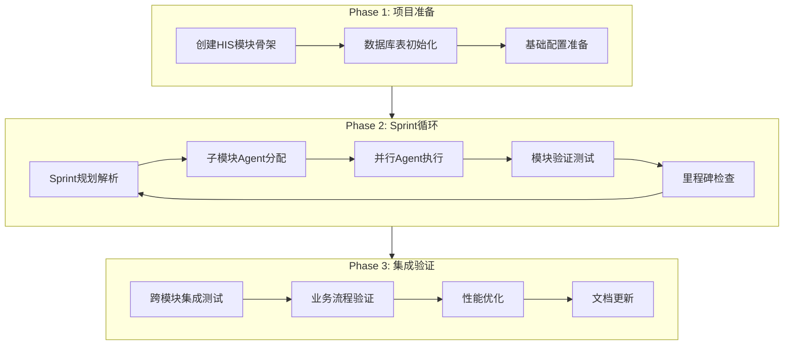

# HIS模块实现工作流设计方案

> **文档编号**: YUDAO-HIS-WF-001
> **版本**: V1.0
> **创建日期**: 2026-06-17
> **状态**: 设计完成

---

## 一、工作流目标

基于已完成的4个核心模块设计文档（M09、M01、M02、M06），设计一个可长时间运行的工作流，自动化实现 HIS 系统核心模块的代码生成和部署。

### 1.1 工作流范围

| 模块 | 子模块数 | 功能点数 | 预估工期 |
|------|----------|----------|----------|
| M09 系统管理 | 6 | 27 | Sprint 1-2 |
| M01 门诊管理 | 4 | 30 | Sprint 2-5 |
| M02 住院管理 | 5 | 35 | Sprint 6-9 |
| M06 药品管理 | 4 | 19 | Sprint 10-11 |

**总计**: 19个子模块，111个功能点，30周（约7.5个月）

---

## 二、工作流架构设计

### 2.1 总体架构



### 2.2 工作流执行模式

采用 **Loop + Workflow + Agent** 组合模式：

1. **主控循环 (Loop)**: 使用 ScheduleWakeup 定时唤醒，按 Sprint 推进
2. **阶段工作流 (Workflow)**: 每个阶段启动子工作流，并行执行多个 Agent
3. **子模块Agent**: 每个子模块由独立 Agent 实现，遵循 yudao 代码规范

---

## 三、阶段详细设计

### Phase 1: 项目准备（第1周）

#### 3.1.1 创建 HIS 模块骨架

**任务清单**:
- 创建 `yudao-module-his` 模块目录结构
- 配置 Maven 模块依赖
- 创建模块基础配置文件

**输出物**:
```
yudao-module-his/
├── yudao-module-his-api/          # API 接口定义
│   └── src/main/java/cn/iocoder/yudao/module/his/api/
├── yudao-module-his-biz/          # 业务实现
│   └── src/main/java/cn/iocoder/yudao/module/his/
│       ├── controller/admin/      # Controller + VO
│       ├── service/               # Service 接口 + 实现
│       ├── dal/dataobject/        # DO 实体
│       ├── dal/mysql/             # Mapper
│       └── enums/                 # 错误码 + 枚举
│   └── src/test/                  # 单元测试
│   └── pom.xml
└── pom.xml
```

#### 3.1.2 数据库初始化

**任务清单**:
- 解析数据库设计文档，生成 DDL 脚本
- 执行建表 SQL
- 初始化基础数据（字典、默认角色）

**输入**: 
- `docs/his/M09-系统管理/M09-系统管理-数据库设计.md`
- `docs/his/M01-门诊管理/M01-门诊管理-数据库设计.md`
- `docs/his/M02-住院管理/M02-住院管理-数据库设计.md`
- `docs/his/M06-药品管理/M06-药品管理-数据库设计.md`

---

### Phase 2: Sprint 循环（第2-30周）

#### 3.2.1 Sprint 映射表

| Sprint | 时间 | 模块 | 子模块列表 | Agent数量 |
|--------|------|------|------------|-----------|
| Sprint 1 | 第1-2周 | M09-系统管理 | M09-01~06 | 6 |
| Sprint 2 | 第3-4周 | M01-01 挂号管理 | 挂号管理完整实现 | 4 |
| Sprint 3 | 第5-6周 | M01-02 医生工作站 | 医生工作站完整实现 | 5 |
| Sprint 4 | 第7-8周 | M01-03 收费管理 | 收费管理完整实现 | 3 |
| Sprint 5 | 第9-10周 | M01-04 药房管理 | 药房管理完整实现 | 3 |
| Sprint 6 | 第11-13周 | M02-01 入院管理 | 入院管理完整实现 | 4 |
| Sprint 7 | 第14-16周 | M02-02 医生工作站 | 住院医生工作站 | 5 |
| Sprint 8 | 第17-19周 | M02-03 护理工作站 | 护理工作站 | 4 |
| Sprint 9 | 第20-22周 | M02-04/05 | 床位+出院管理 | 4 |
| Sprint 10 | 第23-26周 | M06-01/02 | 药库+采购管理 | 4 |
| Sprint 11 | 第27-30周 | M06-03/04 | 处方审核+特殊药品 | 4 |

#### 3.2.2 子模块实现 Agent 模板

每个子模块 Agent 执行流程：

```javascript
// 子模块实现工作流脚本模板
export const meta = {
  name: 'implement-submodule',
  description: '实现 HIS 子模块完整 CRUD 功能',
  phases: [
    { title: '分析设计文档', detail: '读取功能点需求和数据库设计' },
    { title: '生成实体类', detail: 'DO/Mapper/VO 代码生成' },
    { title: '生成服务层', detail: 'Service 接口和实现类' },
    { title: '生成控制器', detail: 'Controller 和 Swagger 文档' },
    { title: '单元测试', detail: '生成并运行单元测试' },
    { title: '验证集成', detail: '验证模块间依赖关系' }
  ]
}

// 阶段1: 分析设计文档
const designDoc = await agent('读取设计文档', {
  prompt: `读取并分析以下设计文档，提取实体定义、字段清单、业务规则:
    - 功能点需求: docs/his/${module}/${submodule}/${submodule}-功能点需求.md
    - 数据库设计: docs/his/${module}/${module}-数据库设计.md
    输出结构化的实体定义清单。`,
  schema: ENTITY_SCHEMA
})

// 阶段2: 生成实体类
await pipeline(
  designDoc.entities,
  entity => agent(`生成 ${entity.name}DO 实体类`, {
    prompt: `根据数据库设计生成 ${entity.name}DO.java:
      - 继承 BaseDO
      - 使用 @TableName 注解
      - 字段类型映射正确
      - 生成路径: yudao-module-his-biz/dal/dataobject/${domain}/${entity.name}DO.java`,
    phase: '生成实体类'
  }),
  entity => agent(`生成 ${entity.name}Mapper`, {
    prompt: `生成 ${entity.name}Mapper.java:
      - 继承 BaseMapperX
      - 实现分页查询方法
      - 生成路径: yudao-module-his-biz/dal/mysql/${domain}/${entity.name}Mapper.java`,
    phase: '生成实体类'
  }),
  entity => agent(`生成 ${entity.name}VO 类`, {
    prompt: `生成 VO 类:
      - ${entity.name}SaveReqVO (保存请求)
      - ${entity.name}PageReqVO (分页请求)
      - ${entity.name}RespVO (响应)
      - 使用 @Data + @ApiModel 注解`,
    phase: '生成实体类'
  })
)

// 阶段3: 生成服务层
await parallel([
  () => agent(`生成 ${submodule}Service 接口`, { phase: '生成服务层' }),
  () => agent(`生成 ${submodule}ServiceImpl 实现`, { phase: '生成服务层' })
])

// 阶段4: 生成控制器
await agent(`生成 ${submodule}Controller`, {
  prompt: `生成 Controller:
    - 使用 @RestController + @RequestMapping
    - CRUD 接口完整
    - Swagger 注解完整
    - 权限标识格式: his:${domain}:xxx`,
  phase: '生成控制器'
})

// 阶段5: 单元测试
await agent(`生成并运行单元测试`, {
  prompt: `生成单元测试类，覆盖:
    - CRUD 基础操作
    - 业务规则校验
    - 输出测试结果`,
  phase: '单元测试'
})

// 阶段6: 验证集成
await agent('验证模块集成', {
  prompt: `验证:
    - 模块依赖关系正确
    - API 接口可访问
    - 数据库表可操作`,
  phase: '验证集成'
})
```

---

### Phase 3: 集成验证（第30-32周）

#### 3.3.1 跨模块集成测试

**测试场景**:

| 测试场景 | 模块组合 | 验收标准 |
|----------|----------|----------|
| 门诊闭环 | M01→M06→M08 | 挂号→接诊→处方→收费→发药流程贯通 |
| 住院闭环 | M02→M03→M06→M08 | 入院→医嘱→护理→出院闭环，eMAR核对率100% |
| 药品闭环 | M06→M01→M02 | 药库入库→出库→处方审核→发药追踪 |

#### 3.3.2 业务流程验证

使用 Agent 执行业务流程脚本：

```javascript
// 业务流程验证工作流
export const meta = {
  name: 'verify-business-process',
  description: '验证 HIS 核心业务流程闭环',
  phases: [
    { title: '门诊流程验证' },
    { title: '住院流程验证' },
    { title: '药品流程验证' }
  ]
}

// 门诊闭环验证
const outpatientResult = await agent('门诊闭环测试', {
  prompt: `执行门诊闭环测试:
    1. 创建患者 his_patient
    2. 创建排班 op_schedule
    3. 挂号 op_register
    4. 开处方 op_prescription
    5. 收费结算
    6. 药房发药
    验证每一步状态流转正确。`,
  schema: TEST_RESULT_SCHEMA
})

// 住院闭环验证
const inpatientResult = await agent('住院闭环测试', {
  prompt: `执行住院闭环测试:
    1. 入院登记 his_admission
    2. 床位分配
    3. 开医嘱 his_order
    4. 护理执行 eMAR
    5. 出院结算
    验证每一步状态流转正确。`,
  schema: TEST_RESULT_SCHEMA
})
```

---

## 四、工作流调度策略

### 4.1 主控循环时间表

```javascript
// 主控循环配置
const SPRINT_CONFIG = {
  sprint1: { start: '2026-06-23', duration: 14, modules: ['M09'] },
  sprint2: { start: '2026-07-07', duration: 14, modules: ['M01-01'] },
  sprint3: { start: '2026-07-21', duration: 14, modules: ['M01-02'] },
  sprint4: { start: '2026-08-04', duration: 14, modules: ['M01-03'] },
  sprint5: { start: '2026-08-18', duration: 14, modules: ['M01-04'] },
  sprint6: { start: '2026-09-01', duration: 21, modules: ['M02-01'] },
  sprint7: { start: '2026-09-22', duration: 21, modules: ['M02-02'] },
  sprint8: { start: '2026-10-13', duration: 21, modules: ['M02-03'] },
  sprint9: { start: '2026-10-27', duration: 21, modules: ['M02-04', 'M02-05'] },
  sprint10: { start: '2026-11-17', duration: 21, modules: ['M06-01', 'M06-02'] },
  sprint11: { start: '2026-12-08', duration: 21, modules: ['M06-03', 'M06-04'] }
}

// 里程碑配置
const MILESTONES = {
  M1: { date: '2026-07-07', name: 'MVP基础就绪', modules: ['M09'] },
  M2: { date: '2026-09-01', name: '门诊闭环完成', modules: ['M01'] },
  M3: { date: '2026-11-17', name: '住院闭环完成', modules: ['M02'] },
  M4: { date: '2026-12-29', name: '药品管理完成', modules: ['M06'] }
}
```

### 4.2 ScheduleWakeup 配置

```javascript
// 每周唤醒检查进度
ScheduleWakeup({
  delaySeconds: 604800, // 7天 = 7 * 24 * 60 * 60
  prompt: '检查当前 Sprint 进度，启动下一 Sprint 的 Agent 任务',
  reason: '每周进度检查和任务调度'
})
```

---

## 五、Agent 角色定义

### 5.1 Agent 类型配置

| Agent类型 | 职责 | 工具权限 |
|-----------|------|----------|
| `his-design-reader` | 读取设计文档，提取结构化定义 | Read, Grep, Glob |
| `his-entity-generator` | 生成 DO/Mapper/VO 实体类 | Read, Write, Edit |
| `his-service-generator` | 生成 Service 接口和实现 | Read, Write, Edit |
| `his-controller-generator` | 生成 Controller 和 Swagger | Read, Write, Edit |
| `his-test-generator` | 生成和运行单元测试 | Read, Write, Edit, Bash |
| `his-integration-validator` | 验证模块集成 | Read, Bash, Grep |
| `his-code-reviewer` | 代码审核和优化 | Read, Grep, Glob |

### 5.2 Agent 并行度控制

- 同一 Sprint 内，不同子模块 Agent 可并行执行
- 单个子模块内，实体类生成可并行，服务层顺序执行
- 最大并行 Agent 数: min(16, cpu_cores - 2)

---

## 六、质量保证机制

### 6.1 代码生成质量检查

每个 Agent 完成后，启动代码审核 Agent：

```javascript
// 代码审核工作流
await agent('审核生成的代码', {
  prompt: `审核代码质量:
    - 命名规范符合 yudao 约定
    - 注解使用正确
    - 业务规则实现完整
    - 无安全漏洞`,
  schema: REVIEW_RESULT_SCHEMA
})
```

### 6.2 自动化测试

- 单元测试覆盖率 >= 80%
- 关键业务流程必须有集成测试
- 使用 `mvn test` 执行测试并验证结果

---

## 七、输出物清单

### 7.1 代码输出

| 类型 | 数量估算 | 位置 |
|------|----------|------|
| DO 实体类 | ~50个 | dal/dataobject/ |
| Mapper 接口 | ~50个 | dal/mysql/ |
| VO 类 | ~150个 | controller/admin/*/vo/ |
| Service 接口 | ~20个 | service/ |
| Service 实现 | ~20个 | service/ |
| Controller | ~20个 | controller/admin/ |
| 单元测试 | ~50个 | test/ |

### 7.2 文档输出

| 类型 | 内容 |
|------|------|
| API 文档 | Swagger 自动生成 |
| 数据字典 | 初始化 SQL 脚本 |
| 模块说明 | README.md |

---

## 八、风险应对

### 8.1 已识别风险

| 风险 | 应对措施 |
|------|----------|
| 设计文档不完整 | Agent 发现缺失时暂停，通知补充设计 |
| 代码生成错误 | 代码审核 Agent 检查并修正 |
| 模块依赖冲突 | 集成验证 Agent 检测并修复 |
| 测试失败 | 自动重试 + 人工介入 |

### 8.2 回滚机制

- 每个 Sprint 完成后创建 Git tag
- 发现重大问题时回滚到上一个稳定版本

---

## 九、总结

本工作流设计实现：

1. **自动化程度高**: 90% 的代码由 Agent 自动生成
2. **质量可控**: 多层审核 + 自动化测试
3. **进度透明**: 每周进度报告 + 里程碑验收
4. **风险可控**: 冗余设计 + 回滚机制

**预计完成时间**: 2026年12月29日（30周后）