# HIS系统 - 业务流程图

> **文档编号**: YUDAO-HIS-BPF-001
> **版本**: V1.0
> **编制日期**: 2026-06-15
> **参考标准**: 国卫规划发〔2018〕4号《全国医院信息化建设标准与规范》| HIMSS EMRAM | HL7 FHIR R4

---

## 1. 文档说明

### 1.1 编写目的

本文档描述YUDAO-AI-HIS系统的核心业务流程，采用文字描述结合Mermaid流程图语法的方式，清晰展示各业务场景的流程步骤、角色参与、数据流转和异常处理。所有流程基于真实医院业务场景设计，参考《全国医院信息化建设标准与规范》中的业务应用要求。

### 1.2 流程图符号说明

| 符号 | 含义 |
|------|------|
| [矩形] | 处理步骤/操作 |
| {菱形} | 判断/决策 |
| (圆角矩形) | 开始/结束 |
| [[子流程]] | 调用子流程 |
| //平行四边形// | 数据输入/输出 |

---

## 2. 门诊业务流程

### 2.1 门诊就诊全流程

**流程说明**：患者从挂号到取药完成一次完整的门诊就诊过程。

```
流程概览：
患者到达 → 挂号/签到 → 候诊 → 就诊 → 缴费 → 取药/检查 → 离院
```

#### 2.1.1 门诊就诊主流程

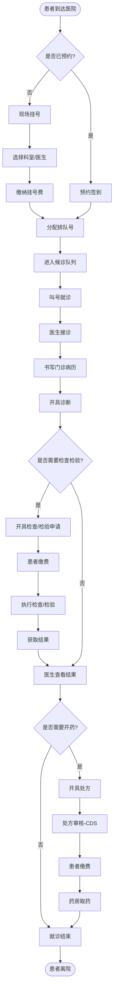

#### 2.1.2 挂号流程详细

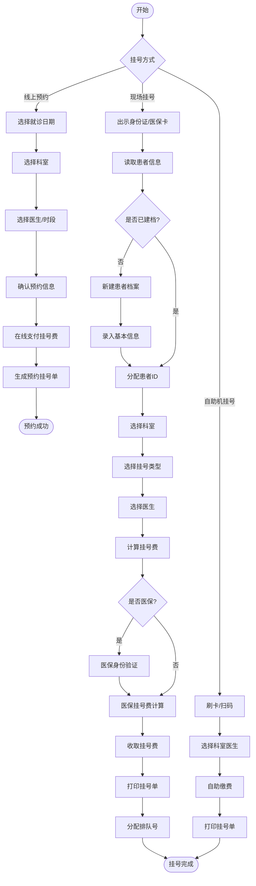

#### 2.1.3 门诊收费流程

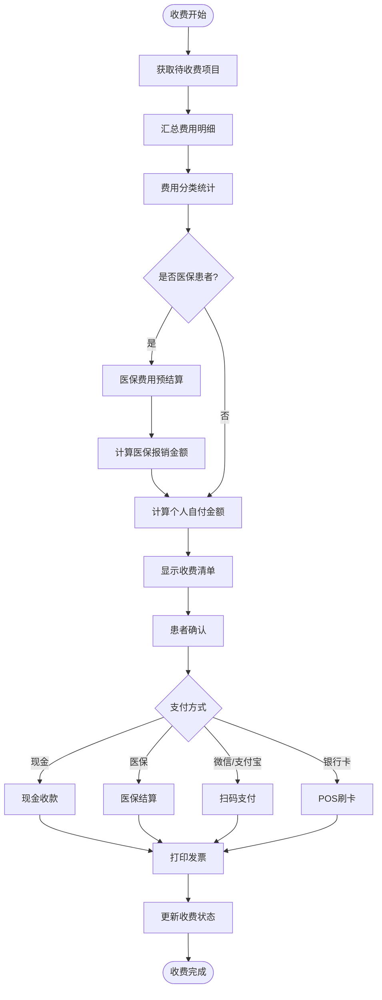

---

## 3. 住院业务流程

### 3.1 住院就诊全流程

**流程说明**：患者从入院登记到出院结算的完整住院过程。

```
流程概览：
入院登记 → 入科 → 医嘱开立 → 检查检验 → 治疗护理 → 手术(如需) → 出院申请 → 出院结算
```

#### 3.1.1 住院主流程

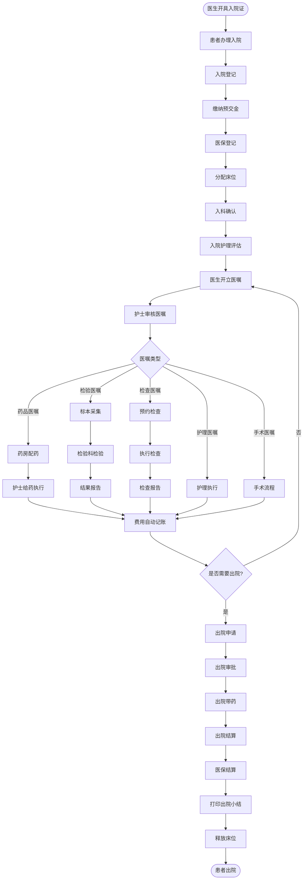

#### 3.1.2 医嘱处理流程

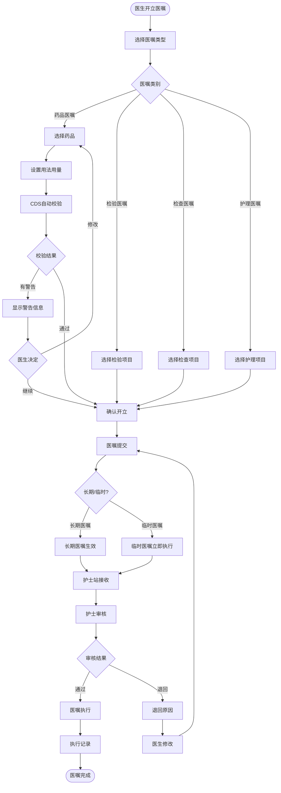

#### 3.1.3 手术流程

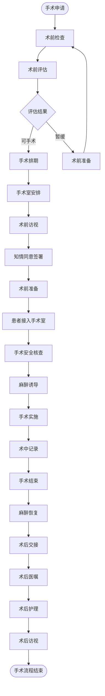

#### 3.1.4 出院结算流程

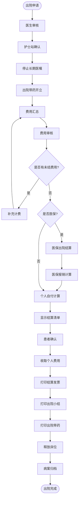

---

## 4. 药品管理流程

### 4.1 药品采购入库流程

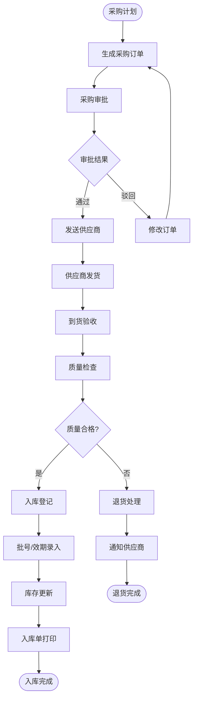

### 4.2 门诊处方调剂流程

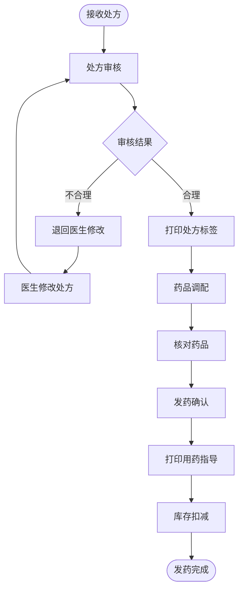

### 4.3 闭环药物管理流程（HIMSS EMRAM Stage 5要求）

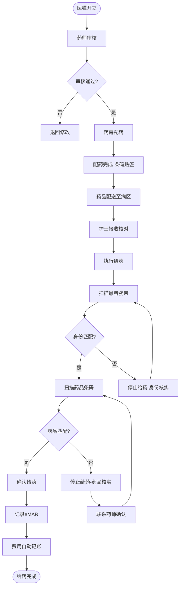

---

## 5. 检验管理流程

### 5.1 检验全流程

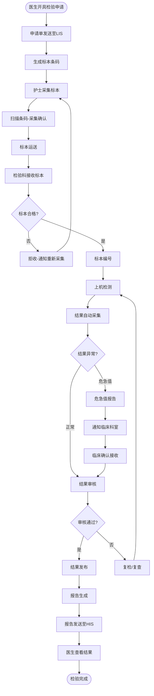

---

## 6. 影像检查流程

### 6.1 影像检查全流程（DICOM标准）

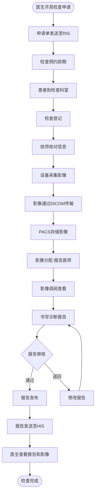

---

## 7. 护理工作流程

### 7.1 护士日常工作流程

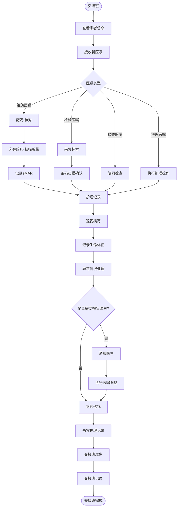

### 7.2 护理评估流程

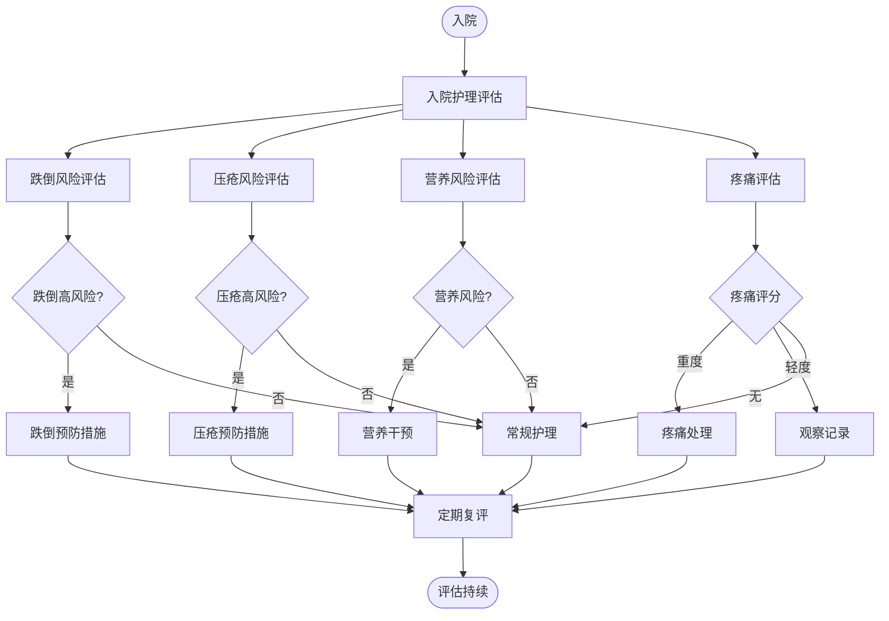

---

## 8. 电子病历管理流程

### 8.1 病历书写与质控流程

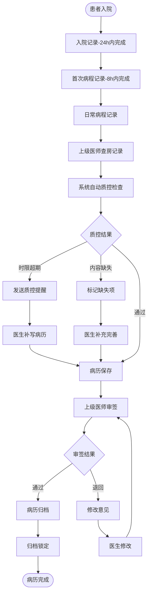

### 8.2 病历封存流程（医疗纠纷场景）

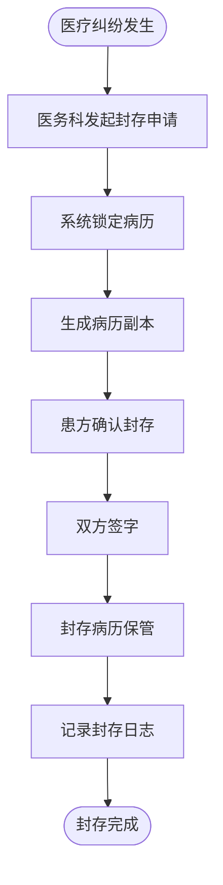

---

## 9. 医保结算流程

### 9.1 门诊医保结算

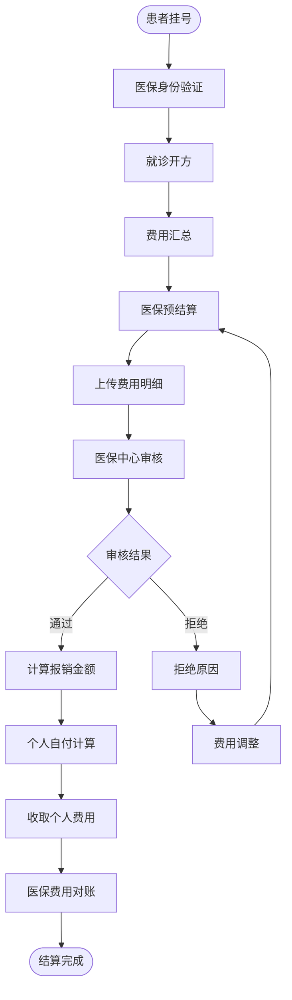

---

## 10. 集成平台数据流转

### 10.1 HL7 FHIR数据交换流程

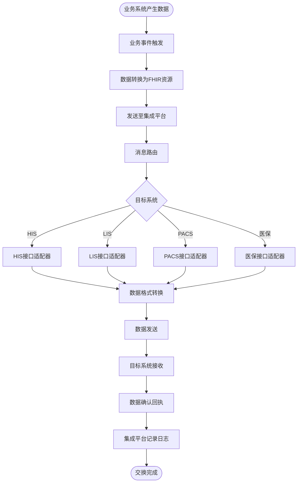

---

## 11. 患者主索引(EMPI)管理流程

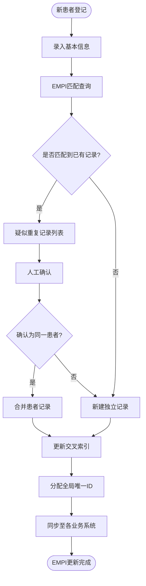

---

## 12. 异常处理流程

### 12.1 系统异常处理

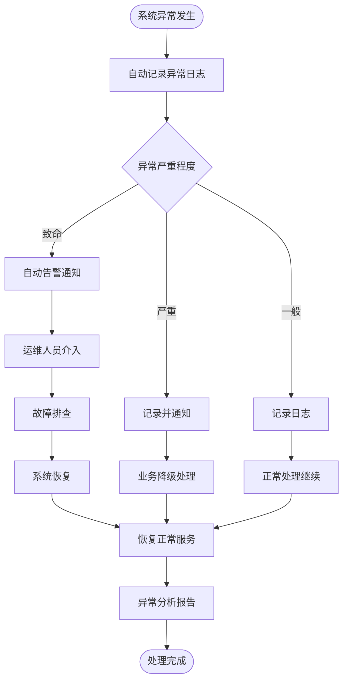

---

## 13. 流程统计与监控指标

| 流程 | 关键指标 | 目标值 |
|------|----------|--------|
| 门诊就诊 | 平均就诊时间 | <= 30分钟 |
| 门诊缴费 | 缴费等待时间 | <= 5分钟 |
| 住院入院 | 入院办理时间 | <= 15分钟 |
| 医嘱执行 | 医嘱执行及时率 | >= 95% |
| 检验报告 | 常规检验报告时间 | <= 2小时 |
| 影像报告 | 常规检查报告时间 | <= 4小时 |
| 危急值 | 危急值通报时间 | <= 15分钟 |
| 药品调剂 | 处方调剂时间 | <= 15分钟 |
| 闭环给药 | 给药执行核对率 | 100% |
| 病历质控 | 入院记录完成率(24h) | 100% |

---

> **文档维护记录**

| 版本 | 日期 | 修改内容 | 作者 |
|------|------|----------|------|
| V1.0 | 2026-06-15 | 初始版本 | YUDAO-AI-HIS项目组 |
