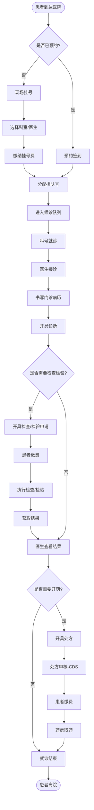
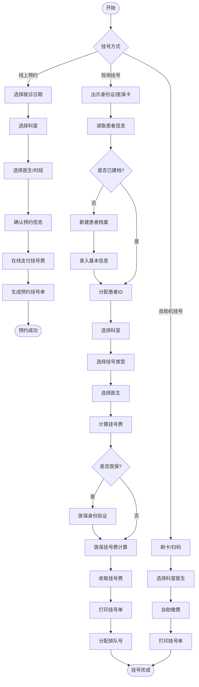
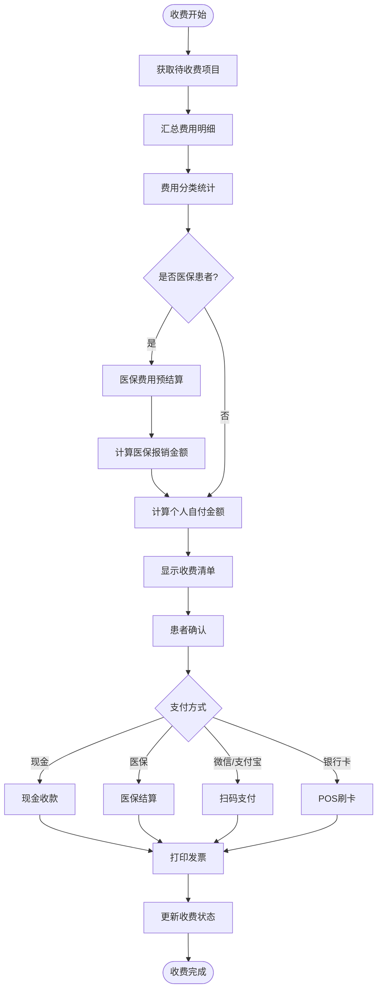
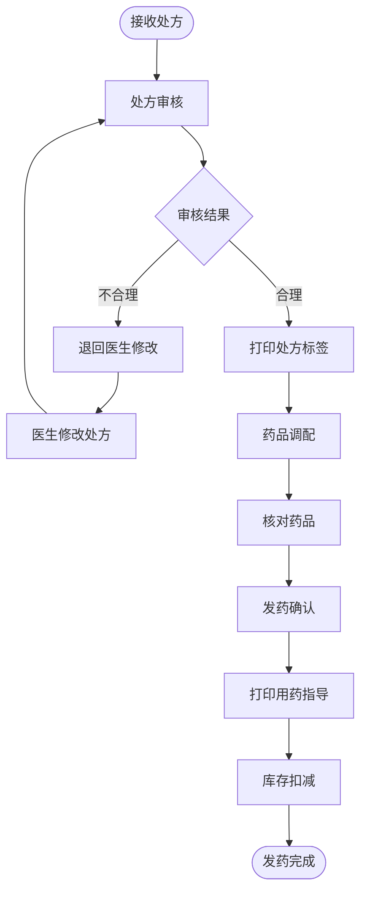

# M01-门诊管理 - 业务流程图

> **模块编号**: M01
> **来源文档**: HIS系统-业务流程图.md

---

## 1. 门诊就诊全流程

**流程说明**：患者从挂号到取药完成一次完整的门诊就诊过程。

```
流程概览：
患者到达 → 挂号/签到 → 候诊 → 就诊 → 缴费 → 取药/检查 → 离院
```

### 1.1 门诊就诊主流程



### 1.2 挂号流程详细



### 1.3 门诊收费流程



---

## 2. 门诊处方调剂流程



---

## 3. 流程统计与监控指标

| 流程 | 关键指标 | 目标值 |
|------|----------|--------|
| 门诊就诊 | 平均就诊时间 | <= 30分钟 |
| 门诊缴费 | 缴费等待时间 | <= 5分钟 |
| 药品调剂 | 处方调剂时间 | <= 15分钟 |