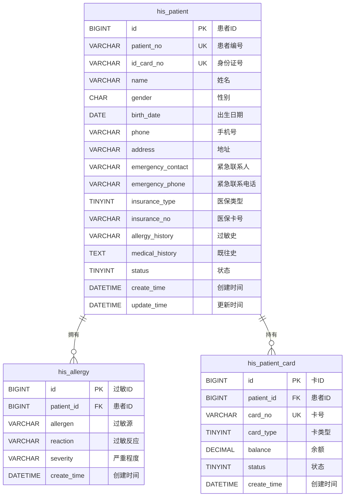

# M01-门诊管理 - 数据库设计文档

> **文档编号**: YUDAO-HIS-DB-M01
> **版本**: V1.0
> **创建日期**: 2026-06-17
> **状态**: 设计中
> **参考文档**: YUDAO-HIS-DB-001, YUDAO-HIS-DM-001

---

## 1. 模块概述

### 1.1 模块范围

本模块包含门诊业务相关的数据库表设计，包括：
- 患者主索引管理
- 预约挂号管理
- 排班管理
- 挂号记录管理
- 处方管理
- 诊断管理

### 1.2 模块表清单

| 表名 | 中文名 | FHIR映射 | 年增量估算 |
|------|--------|----------|------------|
| his_patient | 患者主索引 | Patient | 约50万条 |
| his_allergy | 患者过敏记录 | AllergyIntolerance | 约100万条 |
| his_patient_card | 患者就诊卡 | - | 约50万条 |
| op_schedule | 门诊排班 | - | 约10万条 |
| op_appointment | 预约挂号 | - | 约100万条 |
| op_register | 挂号记录 | Encounter | 约200万条 |
| op_prescription | 门诊处方 | MedicationRequest | 约300万条 |
| op_prescription_item | 处方明细 | - | 约1000万条 |
| his_diagnosis | 诊断记录 | Condition | 约200万条 |

---

## 2. ER图设计

### 2.1 患者域 ER图



### 2.2 门诊域 ER图

```mermaid
erDiagram
    op_schedule {
        BIGINT id PK "排班ID"
        BIGINT dept_id FK "科室ID"
        BIGINT doctor_id FK "医生ID"
        DATE schedule_date "排班日期"
        VARCHAR time_period "时段"
        TIME time_start "开始时间"
        TIME time_end "结束时间"
        INT expert_total "专家号总数"
        INT expert_remaining "专家号剩余"
        INT normal_total "普通号总数"
        INT normal_remaining "普通号剩余"
        TINYINT status "状态"
        DATETIME create_time "创建时间"
    }
    
    op_appointment {
        BIGINT id PK "预约ID"
        VARCHAR appointment_no UK "预约编号"
        BIGINT patient_id FK "患者ID"
        DATE appointment_date "预约日期"
        TIME time_slot_start "时间段开始"
        TIME time_slot_end "时间段结束"
        BIGINT dept_id FK "科室ID"
        BIGINT doctor_id FK "医生ID"
        BIGINT schedule_id FK "排班ID"
        TINYINT register_type "挂号类型"
        TINYINT status "状态"
        BIGINT register_id FK "挂号ID"
        TINYINT create_channel "创建渠道"
        DATETIME create_time "创建时间"
    }
    
    op_register {
        BIGINT id PK "挂号ID"
        VARCHAR register_no UK "挂号编号"
        BIGINT patient_id FK "患者ID"
        DATE register_date "挂号日期"
        BIGINT dept_id FK "科室ID"
        BIGINT doctor_id FK "医生ID"
        BIGINT schedule_id FK "排班ID"
        TINYINT register_type "挂号类型"
        VARCHAR queue_no "排队序号"
        DECIMAL register_fee "挂号费"
        DECIMAL diagnose_fee "诊查费"
        DECIMAL total_fee "费用合计"
        DECIMAL insurance_pay "医保支付"
        DECIMAL personal_pay "个人支付"
        TINYINT pay_type "支付方式"
        DATETIME pay_time "支付时间"
        TINYINT status "状态"
        TINYINT is_appointment "是否预约"
        BIGINT appointment_id FK "预约ID"
        TINYINT triage_level "急诊分级"
        DATETIME create_time "创建时间"
    }
    
    op_prescription {
        BIGINT id PK "处方ID"
        VARCHAR prescription_no UK "处方编号"
        BIGINT register_id FK "挂号ID"
        BIGINT patient_id FK "患者ID"
        BIGINT doctor_id FK "医生ID"
        DECIMAL total_amount "总金额"
        TINYINT status "状态"
        DATETIME create_time "创建时间"
    }
    
    op_prescription_item {
        BIGINT id PK "处方明细ID"
        BIGINT prescription_id FK "处方ID"
        BIGINT drug_id FK "药品ID"
        VARCHAR drug_name "药品名称"
        VARCHAR spec "规格"
        DECIMAL quantity "数量"
        VARCHAR unit "单位"
        DECIMAL unit_price "单价"
        DECIMAL amount "金额"
        VARCHAR usage "用法"
        VARCHAR frequency "频次"
        INT days "天数"
    }
    
    op_schedule ||--o{ op_appointment : "预约"
    op_schedule ||--o{ op_register : "挂号"
    op_appointment ||--o| op_register : "签到"
    op_register ||--o{ op_prescription : "开处方"
    op_prescription ||--o{ op_prescription_item : "包含"
```



---

## 3. DDL脚本设计

### 3.1 患者主索引表 (his_patient)

```sql
-- =============================================
-- 患者主索引表
-- 对应FHIR资源: Patient
-- 年增量估算: 约50万条
-- =============================================
CREATE TABLE `his_patient` (
    `id` BIGINT NOT NULL AUTO_INCREMENT COMMENT '患者ID',
    `patient_no` VARCHAR(20) NOT NULL COMMENT '患者编号',
    `id_card_no` VARCHAR(18) NOT NULL COMMENT '身份证号',
    `name` VARCHAR(50) NOT NULL COMMENT '姓名',
    `gender` CHAR(1) NOT NULL DEFAULT '1' COMMENT '性别: 1男/2女/9未知',
    `birth_date` DATE COMMENT '出生日期',
    `phone` VARCHAR(20) COMMENT '手机号',
    `phone_encrypt` VARCHAR(100) COMMENT '手机号加密',
    `address` VARCHAR(200) COMMENT '地址',
    `province_code` VARCHAR(10) COMMENT '省编码',
    `city_code` VARCHAR(10) COMMENT '市编码',
    `district_code` VARCHAR(10) COMMENT '区编码',
    `emergency_contact` VARCHAR(50) COMMENT '紧急联系人',
    `emergency_phone` VARCHAR(20) COMMENT '紧急联系电话',
    `emergency_relation` VARCHAR(20) COMMENT '紧急联系人关系',
    `insurance_type` TINYINT DEFAULT 0 COMMENT '医保类型: 0自费/1城镇职工/2城镇居民/3新农合',
    `insurance_no` VARCHAR(30) COMMENT '医保卡号',
    `insurance_org` VARCHAR(100) COMMENT '医保机构',
    `allergy_history` VARCHAR(500) COMMENT '过敏史',
    `medical_history` TEXT COMMENT '既往史',
    `family_history` TEXT COMMENT '家族史',
    `blood_type` VARCHAR(5) COMMENT '血型: A/B/AB/O',
    `rh_factor` CHAR(1) COMMENT 'Rh因子: +/−',
    `marital_status` TINYINT COMMENT '婚姻状况: 1未婚/2已婚/3离异/4丧偶',
    `occupation` VARCHAR(50) COMMENT '职业',
    `nation` VARCHAR(20) DEFAULT '汉族' COMMENT '民族',
    `photo_url` VARCHAR(200) COMMENT '照片URL',
    `status` TINYINT NOT NULL DEFAULT 1 COMMENT '状态: 0禁用/1正常',
    `remark` VARCHAR(500) COMMENT '备注',
    `creator` VARCHAR(64) DEFAULT '' COMMENT '创建者',
    `create_time` DATETIME NOT NULL DEFAULT CURRENT_TIMESTAMP COMMENT '创建时间',
    `updater` VARCHAR(64) DEFAULT '' COMMENT '更新者',
    `update_time` DATETIME NOT NULL DEFAULT CURRENT_TIMESTAMP ON UPDATE CURRENT_TIMESTAMP COMMENT '更新时间',
    `deleted` BIT(1) NOT NULL DEFAULT b'0' COMMENT '是否删除',
    `tenant_id` BIGINT NOT NULL DEFAULT 0 COMMENT '租户编号',
    PRIMARY KEY (`id`),
    UNIQUE KEY `uk_patient_no` (`patient_no`),
    UNIQUE KEY `uk_id_card_no` (`id_card_no`),
    KEY `idx_patient_name` (`name`),
    KEY `idx_patient_phone` (`phone`),
    KEY `idx_patient_insurance` (`insurance_no`)
) ENGINE=InnoDB DEFAULT CHARSET=utf8mb4 COLLATE=utf8mb4_unicode_ci COMMENT='患者主索引表';
```

### 3.2 患者过敏记录表 (his_allergy)

```sql
-- =============================================
-- 患者过敏记录表
-- 对应FHIR资源: AllergyIntolerance
-- =============================================
CREATE TABLE `his_allergy` (
    `id` BIGINT NOT NULL AUTO_INCREMENT COMMENT '过敏ID',
    `patient_id` BIGINT NOT NULL COMMENT '患者ID',
    `allergen_type` VARCHAR(20) NOT NULL COMMENT '过敏源类型: 药物/食物/环境/其他',
    `allergen_code` VARCHAR(50) COMMENT '过敏源编码',
    `allergen_name` VARCHAR(100) NOT NULL COMMENT '过敏源名称',
    `reaction` VARCHAR(200) COMMENT '过敏反应',
    `severity` VARCHAR(20) COMMENT '严重程度: 轻度/中度/重度',
    `onset_date` DATE COMMENT '发生日期',
    `source` VARCHAR(50) COMMENT '信息来源: 患者自述/医生诊断/家属描述',
    `status` TINYINT NOT NULL DEFAULT 1 COMMENT '状态: 0无效/1有效',
    `verify_status` TINYINT DEFAULT 0 COMMENT '验证状态: 0未验证/1已验证',
    `creator` VARCHAR(64) DEFAULT '' COMMENT '创建者',
    `create_time` DATETIME NOT NULL DEFAULT CURRENT_TIMESTAMP COMMENT '创建时间',
    `updater` VARCHAR(64) DEFAULT '' COMMENT '更新者',
    `update_time` DATETIME NOT NULL DEFAULT CURRENT_TIMESTAMP ON UPDATE CURRENT_TIMESTAMP COMMENT '更新时间',
    `deleted` BIT(1) NOT NULL DEFAULT b'0' COMMENT '是否删除',
    `tenant_id` BIGINT NOT NULL DEFAULT 0 COMMENT '租户编号',
    PRIMARY KEY (`id`),
    KEY `idx_allergy_patient` (`patient_id`),
    KEY `idx_allergen_type` (`allergen_type`),
    CONSTRAINT `fk_allergy_patient` FOREIGN KEY (`patient_id`) REFERENCES `his_patient` (`id`)
) ENGINE=InnoDB DEFAULT CHARSET=utf8mb4 COLLATE=utf8mb4_unicode_ci COMMENT='患者过敏记录表';
```

### 3.3 门诊排班表 (op_schedule)

```sql
-- =============================================
-- 门诊排班表
-- =============================================
CREATE TABLE `op_schedule` (
    `id` BIGINT NOT NULL AUTO_INCREMENT COMMENT '排班ID',
    `schedule_no` VARCHAR(30) COMMENT '排班编号',
    `dept_id` BIGINT NOT NULL COMMENT '科室ID',
    `dept_name` VARCHAR(100) NOT NULL COMMENT '科室名称',
    `doctor_id` BIGINT NOT NULL COMMENT '医生ID',
    `doctor_name` VARCHAR(50) NOT NULL COMMENT '医生姓名',
    `schedule_date` DATE NOT NULL COMMENT '排班日期',
    `time_period` VARCHAR(10) NOT NULL COMMENT '时段: AM上午/PM下午',
    `time_start` TIME NOT NULL COMMENT '开始时间',
    `time_end` TIME NOT NULL COMMENT '结束时间',
    `expert_total` INT NOT NULL DEFAULT 0 COMMENT '专家号总数',
    `expert_remaining` INT NOT NULL DEFAULT 0 COMMENT '专家号剩余',
    `expert_used` INT NOT NULL DEFAULT 0 COMMENT '专家号已用',
    `normal_total` INT NOT NULL DEFAULT 0 COMMENT '普通号总数',
    `normal_remaining` INT NOT NULL DEFAULT 0 COMMENT '普通号剩余',
    `normal_used` INT NOT NULL DEFAULT 0 COMMENT '普通号已用',
    `register_fee` DECIMAL(10,2) NOT NULL DEFAULT 0.00 COMMENT '挂号费',
    `diagnose_fee` DECIMAL(10,2) NOT NULL DEFAULT 0.00 COMMENT '诊查费',
    `status` TINYINT NOT NULL DEFAULT 1 COMMENT '状态: 1正常/2停诊/3已结束',
    `suspend_reason` VARCHAR(200) COMMENT '停诊原因',
    `suspend_time` DATETIME COMMENT '停诊时间',
    `suspend_by` VARCHAR(50) COMMENT '停诊操作人',
    `remark` VARCHAR(500) COMMENT '备注',
    `creator` VARCHAR(64) DEFAULT '' COMMENT '创建者',
    `create_time` DATETIME NOT NULL DEFAULT CURRENT_TIMESTAMP COMMENT '创建时间',
    `updater` VARCHAR(64) DEFAULT '' COMMENT '更新者',
    `update_time` DATETIME NOT NULL DEFAULT CURRENT_TIMESTAMP ON UPDATE CURRENT_TIMESTAMP COMMENT '更新时间',
    `deleted` BIT(1) NOT NULL DEFAULT b'0' COMMENT '是否删除',
    `tenant_id` BIGINT NOT NULL DEFAULT 0 COMMENT '租户编号',
    PRIMARY KEY (`id`),
    UNIQUE KEY `uk_schedule` (`doctor_id`, `schedule_date`, `time_period`),
    KEY `idx_schedule_date` (`schedule_date`),
    KEY `idx_schedule_dept` (`dept_id`),
    KEY `idx_schedule_doctor` (`doctor_id`),
    KEY `idx_schedule_status` (`status`)
) ENGINE=InnoDB DEFAULT CHARSET=utf8mb4 COLLATE=utf8mb4_unicode_ci COMMENT='门诊排班表';
```

### 3.4 预约挂号表 (op_appointment)

```sql
-- =============================================
-- 预约挂号表
-- =============================================
CREATE TABLE `op_appointment` (
    `id` BIGINT NOT NULL AUTO_INCREMENT COMMENT '预约ID',
    `appointment_no` VARCHAR(30) NOT NULL COMMENT '预约编号',
    `patient_id` BIGINT NOT NULL COMMENT '患者ID',
    `patient_name` VARCHAR(50) NOT NULL COMMENT '患者姓名',
    `patient_phone` VARCHAR(20) NOT NULL COMMENT '患者手机号',
    `appointment_date` DATE NOT NULL COMMENT '预约日期',
    `time_slot_start` TIME NOT NULL COMMENT '时间段开始',
    `time_slot_end` TIME NOT NULL COMMENT '时间段结束',
    `dept_id` BIGINT NOT NULL COMMENT '科室ID',
    `dept_name` VARCHAR(100) NOT NULL COMMENT '科室名称',
    `doctor_id` BIGINT NOT NULL COMMENT '医生ID',
    `doctor_name` VARCHAR(50) NOT NULL COMMENT '医生姓名',
    `schedule_id` BIGINT NOT NULL COMMENT '排班ID',
    `register_type` TINYINT NOT NULL COMMENT '挂号类型: 1普通/2专家',
    `register_fee` DECIMAL(10,2) COMMENT '挂号费',
    `diagnose_fee` DECIMAL(10,2) COMMENT '诊查费',
    `status` TINYINT NOT NULL DEFAULT 1 COMMENT '状态: 1已预约/2已签到/3已取消/4已过期',
    `register_id` BIGINT COMMENT '签到后生成的挂号ID',
    `create_channel` TINYINT NOT NULL COMMENT '创建渠道: 1微信/2APP/3网站/4电话',
    `source_ip` VARCHAR(50) COMMENT '来源IP',
    `cancel_time` DATETIME COMMENT '取消时间',
    `cancel_reason` VARCHAR(200) COMMENT '取消原因',
    `cancel_by` VARCHAR(50) COMMENT '取消人',
    `expire_time` DATETIME COMMENT '过期时间',
    `reminder_sent` TINYINT DEFAULT 0 COMMENT '是否已发送提醒: 0否/1是',
    `creator` VARCHAR(64) DEFAULT '' COMMENT '创建者',
    `create_time` DATETIME NOT NULL DEFAULT CURRENT_TIMESTAMP COMMENT '创建时间',
    `updater` VARCHAR(64) DEFAULT '' COMMENT '更新者',
    `update_time` DATETIME NOT NULL DEFAULT CURRENT_TIMESTAMP ON UPDATE CURRENT_TIMESTAMP COMMENT '更新时间',
    `deleted` BIT(1) NOT NULL DEFAULT b'0' COMMENT '是否删除',
    `tenant_id` BIGINT NOT NULL DEFAULT 0 COMMENT '租户编号',
    PRIMARY KEY (`id`),
    UNIQUE KEY `uk_appointment_no` (`appointment_no`),
    KEY `idx_appointment_patient` (`patient_id`),
    KEY `idx_appointment_date` (`appointment_date`),
    KEY `idx_appointment_dept` (`dept_id`),
    KEY `idx_appointment_doctor` (`doctor_id`),
    KEY `idx_appointment_schedule` (`schedule_id`),
    KEY `idx_appointment_status` (`status`),
    KEY `idx_appointment_phone` (`patient_phone`),
    CONSTRAINT `fk_appointment_patient` FOREIGN KEY (`patient_id`) REFERENCES `his_patient` (`id`)
) ENGINE=InnoDB DEFAULT CHARSET=utf8mb4 COLLATE=utf8mb4_unicode_ci COMMENT='预约挂号表';
```

### 3.5 挂号记录表 (op_register)

```sql
-- =============================================
-- 挂号记录表
-- 对应FHIR资源: Encounter(门诊)
-- 年增量估算: 约200万条
-- =============================================
CREATE TABLE `op_register` (
    `id` BIGINT NOT NULL AUTO_INCREMENT COMMENT '挂号ID',
    `register_no` VARCHAR(30) NOT NULL COMMENT '挂号编号',
    `patient_id` BIGINT NOT NULL COMMENT '患者ID',
    `patient_name` VARCHAR(50) NOT NULL COMMENT '患者姓名',
    `patient_phone` VARCHAR(20) COMMENT '患者手机号',
    `id_card_no` VARCHAR(18) COMMENT '身份证号',
    `register_date` DATE NOT NULL COMMENT '挂号日期',
    `dept_id` BIGINT NOT NULL COMMENT '科室ID',
    `dept_name` VARCHAR(100) NOT NULL COMMENT '科室名称',
    `doctor_id` BIGINT NOT NULL COMMENT '医生ID',
    `doctor_name` VARCHAR(50) NOT NULL COMMENT '医生姓名',
    `schedule_id` BIGINT NOT NULL COMMENT '排班ID',
    `register_type` TINYINT NOT NULL COMMENT '挂号类型: 1普通/2专家/3急诊',
    `queue_no` VARCHAR(10) COMMENT '排队序号',
    `register_fee` DECIMAL(10,2) NOT NULL DEFAULT 0.00 COMMENT '挂号费',
    `diagnose_fee` DECIMAL(10,2) NOT NULL DEFAULT 0.00 COMMENT '诊查费',
    `total_fee` DECIMAL(10,2) NOT NULL DEFAULT 0.00 COMMENT '费用合计',
    `insurance_pay` DECIMAL(10,2) DEFAULT 0.00 COMMENT '医保支付',
    `personal_pay` DECIMAL(10,2) NOT NULL DEFAULT 0.00 COMMENT '个人支付',
    `pay_type` TINYINT NOT NULL COMMENT '支付方式: 1现金/2医保/3微信/4支付宝/5银行卡',
    `pay_time` DATETIME COMMENT '支付时间',
    `pay_trade_no` VARCHAR(50) COMMENT '支付流水号',
    `status` TINYINT NOT NULL DEFAULT 1 COMMENT '状态: 1已挂号/2已就诊/3已退号/4已取消',
    `visit_time` DATETIME COMMENT '就诊时间',
    `finish_time` DATETIME COMMENT '就诊结束时间',
    `is_appointment` TINYINT NOT NULL DEFAULT 0 COMMENT '是否预约: 0现场/1预约',
    `appointment_id` BIGINT COMMENT '预约ID',
    `is_priority` TINYINT DEFAULT 0 COMMENT '是否优先: 0普通/1优先',
    `triage_level` VARCHAR(2) COMMENT '急诊分级: I/II/III/IV',
    `is_missed` TINYINT DEFAULT 0 COMMENT '是否过号: 0正常/1过号',
    `missed_time` DATETIME COMMENT '过号时间',
    `refund_time` DATETIME COMMENT '退号时间',
    `refund_by` VARCHAR(50) COMMENT '退号操作人',
    `refund_reason` VARCHAR(200) COMMENT '退号原因',
    `remark` VARCHAR(500) COMMENT '备注',
    `creator` VARCHAR(64) DEFAULT '' COMMENT '创建者',
    `create_time` DATETIME NOT NULL DEFAULT CURRENT_TIMESTAMP COMMENT '创建时间',
    `updater` VARCHAR(64) DEFAULT '' COMMENT '更新者',
    `update_time` DATETIME NOT NULL DEFAULT CURRENT_TIMESTAMP ON UPDATE CURRENT_TIMESTAMP COMMENT '更新时间',
    `deleted` BIT(1) NOT NULL DEFAULT b'0' COMMENT '是否删除',
    `tenant_id` BIGINT NOT NULL DEFAULT 0 COMMENT '租户编号',
    PRIMARY KEY (`id`),
    UNIQUE KEY `uk_register_no` (`register_no`),
    KEY `idx_register_patient` (`patient_id`),
    KEY `idx_register_date` (`register_date`),
    KEY `idx_register_dept` (`dept_id`),
    KEY `idx_register_doctor` (`doctor_id`),
    KEY `idx_register_status` (`status`),
    KEY `idx_register_date_status` (`register_date`, `status`),
    KEY `idx_register_type` (`register_type`),
    KEY `idx_register_appointment` (`appointment_id`),
    CONSTRAINT `fk_register_patient` FOREIGN KEY (`patient_id`) REFERENCES `his_patient` (`id`)
) ENGINE=InnoDB DEFAULT CHARSET=utf8mb4 COLLATE=utf8mb4_unicode_ci COMMENT='挂号记录表';
```

### 3.6 门诊处方表 (op_prescription)

```sql
-- =============================================
-- 门诊处方表
-- 对应FHIR资源: MedicationRequest
-- =============================================
CREATE TABLE `op_prescription` (
    `id` BIGINT NOT NULL AUTO_INCREMENT COMMENT '处方ID',
    `prescription_no` VARCHAR(30) NOT NULL COMMENT '处方编号',
    `register_id` BIGINT NOT NULL COMMENT '挂号ID',
    `patient_id` BIGINT NOT NULL COMMENT '患者ID',
    `patient_name` VARCHAR(50) NOT NULL COMMENT '患者姓名',
    `doctor_id` BIGINT NOT NULL COMMENT '医生ID',
    `doctor_name` VARCHAR(50) NOT NULL COMMENT '医生姓名',
    `dept_id` BIGINT NOT NULL COMMENT '科室ID',
    `dept_name` VARCHAR(100) NOT NULL COMMENT '科室名称',
    `prescription_type` TINYINT NOT NULL COMMENT '处方类型: 1西药/2中药/3草药',
    `total_amount` DECIMAL(10,2) NOT NULL DEFAULT 0.00 COMMENT '总金额',
    `item_count` INT NOT NULL DEFAULT 0 COMMENT '药品数量',
    `status` TINYINT NOT NULL DEFAULT 1 COMMENT '状态: 1开立/2审核中/3审核通过/4审核退回/5已调配/6已发药/7已退药',
    `audit_pharmacist_id` BIGINT COMMENT '审核药师ID',
    `audit_pharmacist_name` VARCHAR(50) COMMENT '审核药师姓名',
    `audit_time` DATETIME COMMENT '审核时间',
    `audit_opinion` VARCHAR(500) COMMENT '审核意见',
    `dispense_pharmacist_id` BIGINT COMMENT '调配药师ID',
    `dispense_pharmacist_name` VARCHAR(50) COMMENT '调配药师姓名',
    `dispense_time` DATETIME COMMENT '调配时间',
    `send_pharmacist_id` BIGINT COMMENT '发药药师ID',
    `send_pharmacist_name` VARCHAR(50) COMMENT '发药药师姓名',
    `send_time` DATETIME COMMENT '发药时间',
    `diagnosis_code` VARCHAR(50) COMMENT '诊断编码(ICD-10)',
    `diagnosis_name` VARCHAR(200) COMMENT '诊断名称',
    `remark` VARCHAR(500) COMMENT '医嘱备注',
    `creator` VARCHAR(64) DEFAULT '' COMMENT '创建者',
    `create_time` DATETIME NOT NULL DEFAULT CURRENT_TIMESTAMP COMMENT '创建时间',
    `updater` VARCHAR(64) DEFAULT '' COMMENT '更新者',
    `update_time` DATETIME NOT NULL DEFAULT CURRENT_TIMESTAMP ON UPDATE CURRENT_TIMESTAMP COMMENT '更新时间',
    `deleted` BIT(1) NOT NULL DEFAULT b'0' COMMENT '是否删除',
    `tenant_id` BIGINT NOT NULL DEFAULT 0 COMMENT '租户编号',
    PRIMARY KEY (`id`),
    UNIQUE KEY `uk_prescription_no` (`prescription_no`),
    KEY `idx_prescription_register` (`register_id`),
    KEY `idx_prescription_patient` (`patient_id`),
    KEY `idx_prescription_doctor` (`doctor_id`),
    KEY `idx_prescription_status` (`status`),
    KEY `idx_prescription_create_time` (`create_time`),
    CONSTRAINT `fk_prescription_register` FOREIGN KEY (`register_id`) REFERENCES `op_register` (`id`)
) ENGINE=InnoDB DEFAULT CHARSET=utf8mb4 COLLATE=utf8mb4_unicode_ci COMMENT='门诊处方表';
```

### 3.7 处方明细表 (op_prescription_item)

```sql
-- =============================================
-- 处方明细表
-- =============================================
CREATE TABLE `op_prescription_item` (
    `id` BIGINT NOT NULL AUTO_INCREMENT COMMENT '处方明细ID',
    `prescription_id` BIGINT NOT NULL COMMENT '处方ID',
    `item_no` INT NOT NULL COMMENT '序号',
    `drug_id` BIGINT NOT NULL COMMENT '药品ID',
    `drug_code` VARCHAR(50) NOT NULL COMMENT '药品编码',
    `drug_name` VARCHAR(100) NOT NULL COMMENT '药品名称',
    `generic_name` VARCHAR(100) COMMENT '通用名',
    `spec` VARCHAR(50) COMMENT '规格',
    `quantity` DECIMAL(10,2) NOT NULL COMMENT '数量',
    `unit` VARCHAR(20) COMMENT '单位',
    `unit_price` DECIMAL(10,2) NOT NULL COMMENT '单价',
    `amount` DECIMAL(10,2) NOT NULL COMMENT '金额',
    `dosage` DECIMAL(10,2) COMMENT '单次剂量',
    `dosage_unit` VARCHAR(20) COMMENT '剂量单位',
    `frequency` VARCHAR(50) COMMENT '频次',
    `usage` VARCHAR(50) COMMENT '用法',
    `days` INT COMMENT '天数',
    `skin_test` TINYINT DEFAULT 0 COMMENT '是否皮试: 0否/1是',
    `skin_test_result` TINYINT COMMENT '皮试结果: 1阴性/2阳性',
    `batch_no` VARCHAR(50) COMMENT '批号',
    `expire_date` DATE COMMENT '有效期',
    `remark` VARCHAR(200) COMMENT '备注',
    `creator` VARCHAR(64) DEFAULT '' COMMENT '创建者',
    `create_time` DATETIME NOT NULL DEFAULT CURRENT_TIMESTAMP COMMENT '创建时间',
    `updater` VARCHAR(64) DEFAULT '' COMMENT '更新者',
    `update_time` DATETIME NOT NULL DEFAULT CURRENT_TIMESTAMP ON UPDATE CURRENT_TIMESTAMP COMMENT '更新时间',
    `deleted` BIT(1) NOT NULL DEFAULT b'0' COMMENT '是否删除',
    `tenant_id` BIGINT NOT NULL DEFAULT 0 COMMENT '租户编号',
    PRIMARY KEY (`id`),
    KEY `idx_prescription_item_prescription` (`prescription_id`),
    KEY `idx_prescription_item_drug` (`drug_id`),
    CONSTRAINT `fk_prescription_item_prescription` FOREIGN KEY (`prescription_id`) REFERENCES `op_prescription` (`id`)
) ENGINE=InnoDB DEFAULT CHARSET=utf8mb4 COLLATE=utf8mb4_unicode_ci COMMENT='处方明细表';
```

### 3.8 诊断记录表 (his_diagnosis)

```sql
-- =============================================
-- 诊断记录表
-- 对应FHIR资源: Condition
-- 年增量估算: 约200万条
-- =============================================
CREATE TABLE `his_diagnosis` (
    `id` BIGINT NOT NULL AUTO_INCREMENT COMMENT '诊断ID',
    `diagnosis_no` VARCHAR(30) COMMENT '诊断编号',
    `patient_id` BIGINT NOT NULL COMMENT '患者ID',
    `patient_name` VARCHAR(50) COMMENT '患者姓名',
    `admission_id` BIGINT COMMENT '住院ID',
    `register_id` BIGINT COMMENT '挂号ID',
    `diagnosis_type` TINYINT NOT NULL COMMENT '诊断类型: 1门诊诊断/2入院诊断/3出院诊断/4术后诊断',
    `diagnosis_order` TINYINT NOT NULL DEFAULT 1 COMMENT '诊断顺序: 1主诊断/2副诊断',
    `diagnosis_code` VARCHAR(50) NOT NULL COMMENT '诊断编码(ICD-10)',
    `diagnosis_name` VARCHAR(200) NOT NULL COMMENT '诊断名称',
    `diagnosis_status` TINYINT DEFAULT 1 COMMENT '诊断状态: 1疑似/2确诊/3排除',
    `onset_date` DATE COMMENT '发病日期',
    `diagnosis_time` DATETIME NOT NULL COMMENT '诊断时间',
    `doctor_id` BIGINT NOT NULL COMMENT '诊断医生ID',
    `doctor_name` VARCHAR(50) COMMENT '诊断医生姓名',
    `dept_id` BIGINT COMMENT '科室ID',
    `dept_name` VARCHAR(100) COMMENT '科室名称',
    `remark` VARCHAR(500) COMMENT '备注',
    `creator` VARCHAR(64) DEFAULT '' COMMENT '创建者',
    `create_time` DATETIME NOT NULL DEFAULT CURRENT_TIMESTAMP COMMENT '创建时间',
    `updater` VARCHAR(64) DEFAULT '' COMMENT '更新者',
    `update_time` DATETIME NOT NULL DEFAULT CURRENT_TIMESTAMP ON UPDATE CURRENT_TIMESTAMP COMMENT '更新时间',
    `deleted` BIT(1) NOT NULL DEFAULT b'0' COMMENT '是否删除',
    `tenant_id` BIGINT NOT NULL DEFAULT 0 COMMENT '租户编号',
    PRIMARY KEY (`id`),
    KEY `idx_diagnosis_patient` (`patient_id`),
    KEY `idx_diagnosis_admission` (`admission_id`),
    KEY `idx_diagnosis_register` (`register_id`),
    KEY `idx_diagnosis_code` (`diagnosis_code`),
    KEY `idx_diagnosis_time` (`diagnosis_time`),
    KEY `idx_diagnosis_type` (`diagnosis_type`),
    CONSTRAINT `fk_diagnosis_patient` FOREIGN KEY (`patient_id`) REFERENCES `his_patient` (`id`)
) ENGINE=InnoDB DEFAULT CHARSET=utf8mb4 COLLATE=utf8mb4_unicode_ci COMMENT='诊断记录表';
```

---

## 4. 索引设计

### 4.1 索引汇总表

| 表名 | 索引名 | 索引类型 | 索引字段 | 说明 |
|------|--------|----------|----------|------|
| his_patient | uk_patient_no | 唯一 | patient_no | 患者编号唯一 |
| his_patient | uk_id_card_no | 唯一 | id_card_no | 身份证号唯一 |
| his_patient | idx_patient_name | 普通 | name | 按姓名查询 |
| his_patient | idx_patient_phone | 普通 | phone | 按手机号查询 |
| his_patient | idx_patient_insurance | 普通 | insurance_no | 按医保卡号查询 |
| his_allergy | idx_allergy_patient | 普通 | patient_id | 按患者查询过敏记录 |
| op_schedule | uk_schedule | 唯一 | doctor_id, schedule_date, time_period | 同医生同日期同时段唯一 |
| op_schedule | idx_schedule_date | 普通 | schedule_date | 按排班日期查询 |
| op_schedule | idx_schedule_dept | 普通 | dept_id | 按科室查询排班 |
| op_appointment | uk_appointment_no | 唯一 | appointment_no | 预约编号唯一 |
| op_appointment | idx_appointment_patient | 普通 | patient_id | 按患者查询预约 |
| op_appointment | idx_appointment_date | 普通 | appointment_date | 按预约日期查询 |
| op_register | uk_register_no | 唯一 | register_no | 挂号编号唯一 |
| op_register | idx_register_patient | 普通 | patient_id | 按患者查询挂号 |
| op_register | idx_register_date | 普通 | register_date | 按挂号日期查询 |
| op_register | idx_register_date_status | 联合 | register_date, status | 按日期和状态查询 |
| op_prescription | uk_prescription_no | 唯一 | prescription_no | 处方编号唯一 |
| op_prescription | idx_prescription_register | 普通 | register_id | 按挂号查询处方 |
| op_prescription | idx_prescription_patient | 普通 | patient_id | 按患者查询处方 |
| op_prescription | idx_prescription_status | 普通 | status | 按处方状态查询 |
| op_prescription_item | idx_prescription_item_prescription | 普通 | prescription_id | 按处方查询明细 |
| op_prescription_item | idx_prescription_item_drug | 普通 | drug_id | 按药品查询 |
| his_diagnosis | idx_diagnosis_patient | 普通 | patient_id | 按患者查询诊断 |
| his_diagnosis | idx_diagnosis_register | 普通 | register_id | 按挂号查询诊断 |
| his_diagnosis | idx_diagnosis_code | 普通 | diagnosis_code | 按诊断编码查询 |

---

## 5. 分表策略

| 数据表 | 分表策略 | 分表字段 | 说明 |
|--------|----------|----------|------|
| op_prescription_item | 按年分表 | create_time | 处方明细数据量大，约1000万条/年 |
| his_diagnosis | 按年分表 | create_time | 诊断记录数据量大，约200万条/年 |

---

## 6. FHIR资源映射

| HIS实体 | FHIR资源 | 映射说明 |
|---------|----------|----------|
| his_patient | Patient | 患者主索引，EMPI全局唯一 |
| op_register | Encounter | 门诊挂号/就诊记录 |
| op_prescription | MedicationRequest | 门诊处方 |
| his_diagnosis | Condition | 诊断记录 |
| his_allergy | AllergyIntolerance | 过敏史记录 |

---

## 7. 变更历史

| 版本 | 日期 | 变更内容 | 变更人 |
|------|------|----------|--------|
| V1.0 | 2026-06-17 | 从全局数据库设计文档拆分创建 | Claude AI |

---

> **模块负责人**: ________________
> **最后更新**: 2026-06-17