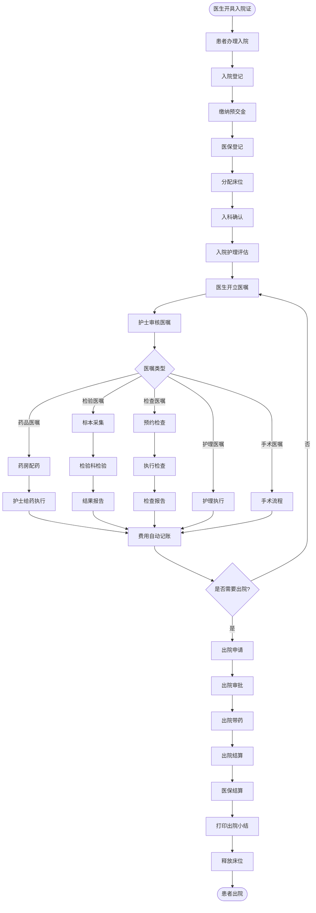
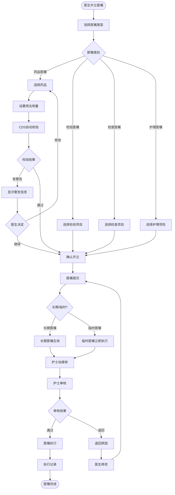
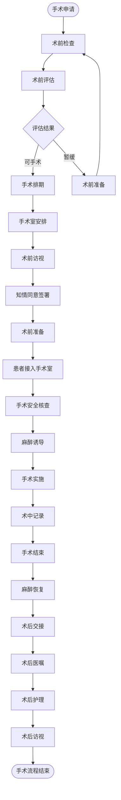
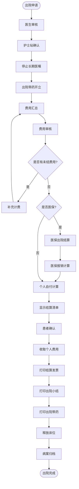
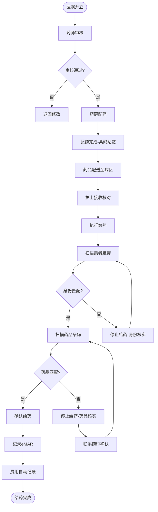
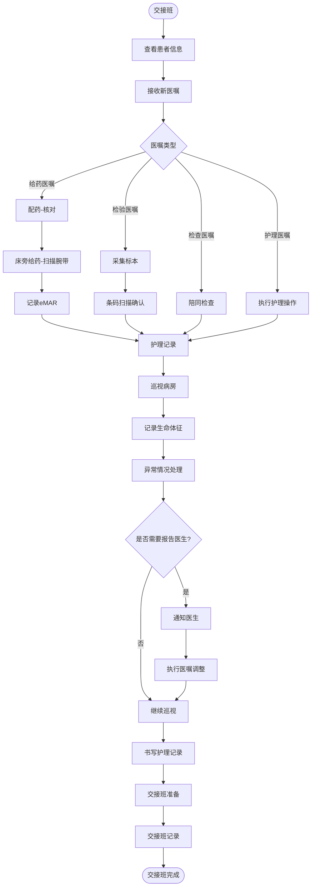
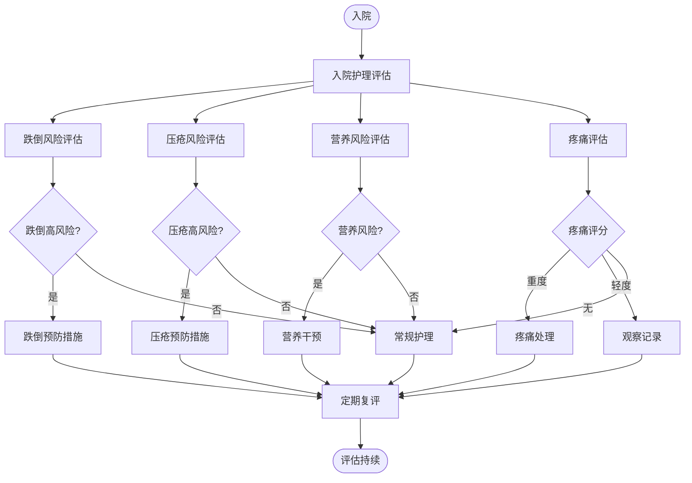

# M02-住院管理 - 业务流程图

> **模块编号**: M02
> **来源文档**: HIS系统-业务流程图.md

---

## 1. 住院就诊全流程

**流程说明**：患者从入院登记到出院结算的完整住院过程。

```
流程概览：
入院登记 → 入科 → 医嘱开立 → 检查检验 → 治疗护理 → 手术(如需) → 出院申请 → 出院结算
```

### 1.1 住院主流程



### 1.2 医嘱处理流程



### 1.3 手术流程



### 1.4 出院结算流程



---

## 2. 闭环药物管理流程（HIMSS EMRAM Stage 5要求）



---

## 3. 护理工作流程

### 3.1 护士日常工作流程



### 3.2 护理评估流程



---

## 4. 流程统计与监控指标

| 流程 | 关键指标 | 目标值 |
|------|----------|--------|
| 住院入院 | 入院办理时间 | <= 15分钟 |
| 医嘱执行 | 医嘱执行及时率 | >= 95% |
| 闭环给药 | 给药执行核对率 | 100% |