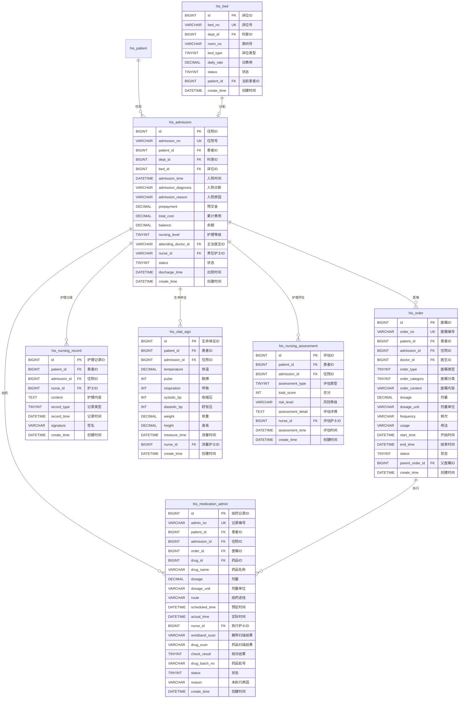

# M02-住院管理 - 数据库设计文档

> **文档编号**: YUDAO-HIS-DB-M02
> **版本**: V1.0
> **创建日期**: 2026-06-17
> **状态**: 设计中
> **参考文档**: YUDAO-HIS-DB-001, YUDAO-HIS-DM-001

---

## 1. 模块概述

### 1.1 模块范围

本模块包含住院业务相关的数据库表设计，包括：
- 入院管理
- 医嘱管理
- 给药管理(eMAR)
- 护理管理
- 床位管理
- 生命体征管理

### 1.2 模块表清单

| 表名 | 中文名 | FHIR映射 | 年增量估算 |
|------|--------|----------|------------|
| his_admission | 住院信息 | Encounter | 约30万条 |
| his_order | 医嘱 | ServiceRequest/MedicationRequest | 约1000万条 |
| his_medication_admin | 给药记录(eMAR) | MedicationAdministration | 约2000万条 |
| his_nursing_record | 护理记录 | - | 约500万条 |
| his_vital_sign | 生命体征 | Observation | 约300万条 |
| his_nursing_assessment | 护理评估 | - | 约100万条 |
| his_bed | 床位 | Location | 约1万条 |

---

## 2. ER图设计

### 2.1 住院域 ER图



---

## 3. DDL脚本设计

### 3.1 住院信息表 (his_admission)

```sql
-- =============================================
-- 住院信息表
-- 对应FHIR资源: Encounter(住院)
-- 年增量估算: 约30万条
-- =============================================
CREATE TABLE `his_admission` (
    `id` BIGINT NOT NULL AUTO_INCREMENT COMMENT '住院ID',
    `admission_no` VARCHAR(30) NOT NULL COMMENT '住院号',
    `patient_id` BIGINT NOT NULL COMMENT '患者ID',
    `patient_name` VARCHAR(50) NOT NULL COMMENT '患者姓名',
    `gender` CHAR(1) COMMENT '性别',
    `age` INT COMMENT '年龄',
    `dept_id` BIGINT NOT NULL COMMENT '科室ID',
    `dept_name` VARCHAR(100) NOT NULL COMMENT '科室名称',
    `ward_id` BIGINT COMMENT '病区ID',
    `ward_name` VARCHAR(100) COMMENT '病区名称',
    `bed_id` BIGINT COMMENT '床位ID',
    `bed_no` VARCHAR(20) COMMENT '床位号',
    `room_no` VARCHAR(20) COMMENT '房间号',
    `admission_time` DATETIME NOT NULL COMMENT '入院时间',
    `admission_type` TINYINT NOT NULL COMMENT '入院方式: 1门诊入院/2急诊入院/3转院/4其他',
    `admission_diagnosis` VARCHAR(500) COMMENT '入院诊断',
    `admission_diagnosis_code` VARCHAR(50) COMMENT '入院诊断编码(ICD-10)',
    `admission_reason` VARCHAR(500) COMMENT '入院原因',
    `register_id` BIGINT COMMENT '门诊挂号ID(门诊入院时)',
    `prepayment` DECIMAL(12,2) NOT NULL DEFAULT 0.00 COMMENT '预交金',
    `total_cost` DECIMAL(12,2) NOT NULL DEFAULT 0.00 COMMENT '累计费用',
    `balance` DECIMAL(12,2) NOT NULL DEFAULT 0.00 COMMENT '余额',
    `deposit_amount` DECIMAL(12,2) DEFAULT 0.00 COMMENT '押金',
    `nursing_level` TINYINT NOT NULL DEFAULT 1 COMMENT '护理等级: 1特级/2一级/3二级/3三级',
    `diet_type` VARCHAR(50) COMMENT '饮食类型',
    `attending_doctor_id` BIGINT NOT NULL COMMENT '主治医生ID',
    `attending_doctor_name` VARCHAR(50) NOT NULL COMMENT '主治医生姓名',
    `director_doctor_id` BIGINT COMMENT '主任医生ID',
    `director_doctor_name` VARCHAR(50) COMMENT '主任医生姓名',
    `nurse_id` BIGINT COMMENT '责任护士ID',
    `nurse_name` VARCHAR(50) COMMENT '责任护士姓名',
    `status` TINYINT NOT NULL DEFAULT 1 COMMENT '状态: 1在院/2出院/3转科/4死亡',
    `discharge_time` DATETIME COMMENT '出院时间',
    `discharge_type` TINYINT COMMENT '出院方式: 1医嘱出院/2自动出院/3转院/4死亡',
    `discharge_diagnosis` VARCHAR(500) COMMENT '出院诊断',
    `discharge_diagnosis_code` VARCHAR(50) COMMENT '出院诊断编码',
    `discharge_summary` TEXT COMMENT '出院小结',
    `is_surgery` TINYINT DEFAULT 0 COMMENT '是否手术: 0否/1是',
    `is_critical` TINYINT DEFAULT 0 COMMENT '是否危重: 0否/1是',
    `allergy_alert` VARCHAR(500) COMMENT '过敏警示',
    `remark` VARCHAR(500) COMMENT '备注',
    `creator` VARCHAR(64) DEFAULT '' COMMENT '创建者',
    `create_time` DATETIME NOT NULL DEFAULT CURRENT_TIMESTAMP COMMENT '创建时间',
    `updater` VARCHAR(64) DEFAULT '' COMMENT '更新者',
    `update_time` DATETIME NOT NULL DEFAULT CURRENT_TIMESTAMP ON UPDATE CURRENT_TIMESTAMP COMMENT '更新时间',
    `deleted` BIT(1) NOT NULL DEFAULT b'0' COMMENT '是否删除',
    `tenant_id` BIGINT NOT NULL DEFAULT 0 COMMENT '租户编号',
    PRIMARY KEY (`id`),
    UNIQUE KEY `uk_admission_no` (`admission_no`),
    KEY `idx_admission_patient` (`patient_id`),
    KEY `idx_admission_dept` (`dept_id`),
    KEY `idx_admission_bed` (`bed_id`),
    KEY `idx_admission_status` (`status`),
    KEY `idx_admission_time` (`admission_time`),
    KEY `idx_admission_doctor` (`attending_doctor_id`),
    KEY `idx_admission_nurse` (`nurse_id`),
    CONSTRAINT `fk_admission_patient` FOREIGN KEY (`patient_id`) REFERENCES `his_patient` (`id`)
) ENGINE=InnoDB DEFAULT CHARSET=utf8mb4 COLLATE=utf8mb4_unicode_ci COMMENT='住院信息表';
```

### 3.2 医嘱表 (his_order)

```sql
-- =============================================
-- 医嘱表
-- 对应FHIR资源: ServiceRequest/MedicationRequest
-- 年增量估算: 约1000万条
-- =============================================
CREATE TABLE `his_order` (
    `id` BIGINT NOT NULL AUTO_INCREMENT COMMENT '医嘱ID',
    `order_no` VARCHAR(30) NOT NULL COMMENT '医嘱编号',
    `patient_id` BIGINT NOT NULL COMMENT '患者ID',
    `patient_name` VARCHAR(50) NOT NULL COMMENT '患者姓名',
    `admission_id` BIGINT NOT NULL COMMENT '住院ID',
    `doctor_id` BIGINT NOT NULL COMMENT '医生ID',
    `doctor_name` VARCHAR(50) NOT NULL COMMENT '医生姓名',
    `dept_id` BIGINT NOT NULL COMMENT '科室ID',
    `order_type` TINYINT NOT NULL COMMENT '医嘱类型: 1药品/2检查/3检验/4护理/5饮食/6其他',
    `order_category` TINYINT NOT NULL COMMENT '医嘱分类: 1长期/2临时',
    `order_content` VARCHAR(500) NOT NULL COMMENT '医嘱内容',
    `drug_id` BIGINT COMMENT '药品ID',
    `drug_code` VARCHAR(50) COMMENT '药品编码',
    `drug_name` VARCHAR(100) COMMENT '药品名称',
    `spec` VARCHAR(50) COMMENT '规格',
    `dosage` DECIMAL(10,2) COMMENT '剂量',
    `dosage_unit` VARCHAR(20) COMMENT '剂量单位',
    `frequency` VARCHAR(50) COMMENT '频次',
    `usage` VARCHAR(50) COMMENT '用法',
    `route` VARCHAR(50) COMMENT '给药途径',
    `days` INT COMMENT '天数',
    `skin_test` TINYINT DEFAULT 0 COMMENT '是否皮试: 0否/1是',
    `skin_test_result` TINYINT COMMENT '皮试结果: 1阴性/2阳性',
    `start_time` DATETIME NOT NULL COMMENT '开始时间',
    `end_time` DATETIME COMMENT '结束时间',
    `execute_time` TIME COMMENT '执行时间',
    `status` TINYINT NOT NULL DEFAULT 1 COMMENT '状态: 1开立/2审核/3执行中/4已完成/5已作废/6已停止',
    `audit_nurse_id` BIGINT COMMENT '审核护士ID',
    `audit_nurse_name` VARCHAR(50) COMMENT '审核护士姓名',
    `audit_time` DATETIME COMMENT '审核时间',
    `stop_doctor_id` BIGINT COMMENT '停止医生ID',
    `stop_doctor_name` VARCHAR(50) COMMENT '停止医生姓名',
    `stop_time` DATETIME COMMENT '停止时间',
    `stop_reason` VARCHAR(200) COMMENT '停止原因',
    `cancel_doctor_id` BIGINT COMMENT '作废医生ID',
    `cancel_doctor_name` VARCHAR(50) COMMENT '作废医生姓名',
    `cancel_time` DATETIME COMMENT '作废时间',
    `cancel_reason` VARCHAR(200) COMMENT '作废原因',
    `parent_order_id` BIGINT COMMENT '父医嘱ID(子医嘱)',
    `is_stat` TINYINT DEFAULT 0 COMMENT '是否急用: 0否/1是',
    `is_prn` TINYINT DEFAULT 0 COMMENT '是否必要时: 0否/1是',
    `cds_check_result` TEXT COMMENT 'CDS校验结果(JSON)',
    `cds_warning_level` TINYINT COMMENT 'CDS警告级别: 0无/1提示/2警告/3禁止',
    `remark` VARCHAR(500) COMMENT '备注',
    `creator` VARCHAR(64) DEFAULT '' COMMENT '创建者',
    `create_time` DATETIME NOT NULL DEFAULT CURRENT_TIMESTAMP COMMENT '创建时间',
    `updater` VARCHAR(64) DEFAULT '' COMMENT '更新者',
    `update_time` DATETIME NOT NULL DEFAULT CURRENT_TIMESTAMP ON UPDATE CURRENT_TIMESTAMP COMMENT '更新时间',
    `deleted` BIT(1) NOT NULL DEFAULT b'0' COMMENT '是否删除',
    `tenant_id` BIGINT NOT NULL DEFAULT 0 COMMENT '租户编号',
    PRIMARY KEY (`id`),
    UNIQUE KEY `uk_order_no` (`order_no`),
    KEY `idx_order_patient` (`patient_id`),
    KEY `idx_order_admission` (`admission_id`),
    KEY `idx_order_doctor` (`doctor_id`),
    KEY `idx_order_status` (`status`),
    KEY `idx_order_type` (`order_type`),
    KEY `idx_order_category` (`order_category`),
    KEY `idx_order_start_time` (`start_time`),
    KEY `idx_order_drug` (`drug_id`),
    KEY `idx_order_parent` (`parent_order_id`),
    CONSTRAINT `fk_order_patient` FOREIGN KEY (`patient_id`) REFERENCES `his_patient` (`id`),
    CONSTRAINT `fk_order_admission` FOREIGN KEY (`admission_id`) REFERENCES `his_admission` (`id`)
) ENGINE=InnoDB DEFAULT CHARSET=utf8mb4 COLLATE=utf8mb4_unicode_ci COMMENT='医嘱表';
```

### 3.3 给药记录表(eMAR) (his_medication_admin)

```sql
-- =============================================
-- 给药记录表(eMAR)
-- 对应FHIR资源: MedicationAdministration
-- 年增量估算: 约2000万条
-- 分表策略: 按年分表
-- HIMSS EMRAM Stage 5核心表
-- =============================================
CREATE TABLE `his_medication_admin` (
    `id` BIGINT NOT NULL AUTO_INCREMENT COMMENT '给药记录ID',
    `admin_no` VARCHAR(30) NOT NULL COMMENT '记录编号',
    `patient_id` BIGINT NOT NULL COMMENT '患者ID',
    `patient_name` VARCHAR(50) NOT NULL COMMENT '患者姓名',
    `admission_id` BIGINT NOT NULL COMMENT '住院ID',
    `admission_no` VARCHAR(30) COMMENT '住院号',
    `order_id` BIGINT NOT NULL COMMENT '医嘱ID',
    `order_no` VARCHAR(30) COMMENT '医嘱编号',
    `drug_id` BIGINT NOT NULL COMMENT '药品ID',
    `drug_code` VARCHAR(50) COMMENT '药品编码',
    `drug_name` VARCHAR(100) NOT NULL COMMENT '药品名称',
    `spec` VARCHAR(50) COMMENT '规格',
    `dosage` DECIMAL(10,2) NOT NULL COMMENT '剂量',
    `dosage_unit` VARCHAR(20) COMMENT '剂量单位',
    `route` VARCHAR(50) COMMENT '给药途径',
    `scheduled_time` DATETIME NOT NULL COMMENT '预定执行时间',
    `actual_time` DATETIME COMMENT '实际执行时间',
    `nurse_id` BIGINT NOT NULL COMMENT '执行护士ID',
    `nurse_name` VARCHAR(50) NOT NULL COMMENT '执行护士姓名',
    `wristband_scan_status` TINYINT NOT NULL DEFAULT 0 COMMENT '腕带扫描状态: 0未扫描/1匹配/2不匹配',
    `wristband_scan_time` DATETIME COMMENT '腕带扫描时间',
    `wristband_scan_result` VARCHAR(200) COMMENT '腕带扫描结果',
    `drug_scan_status` TINYINT NOT NULL DEFAULT 0 COMMENT '药品扫描状态: 0未扫描/1匹配/2不匹配',
    `drug_scan_time` DATETIME COMMENT '药品扫描时间',
    `drug_scan_result` VARCHAR(200) COMMENT '药品扫描结果',
    `drug_batch_no` VARCHAR(50) COMMENT '药品批号',
    `drug_expire_date` DATE COMMENT '药品有效期',
    `check_result` TINYINT NOT NULL COMMENT '核对结果: 1通过/2不通过',
    `status` TINYINT NOT NULL DEFAULT 1 COMMENT '状态: 1待执行/2已执行/3未执行/4延迟执行',
    `reason` VARCHAR(200) COMMENT '未执行/延迟原因',
    `reason_type` VARCHAR(50) COMMENT '原因类型: 患者拒绝/病情变化/药品问题/其他',
    `notify_doctor` TINYINT DEFAULT 0 COMMENT '是否通知医生: 0否/1是',
    `charge_status` TINYINT DEFAULT 0 COMMENT '记账状态: 0未记账/1已记账',
    `charge_time` DATETIME COMMENT '记账时间',
    `remark` VARCHAR(500) COMMENT '备注',
    `creator` VARCHAR(64) DEFAULT '' COMMENT '创建者',
    `create_time` DATETIME NOT NULL DEFAULT CURRENT_TIMESTAMP COMMENT '创建时间',
    `updater` VARCHAR(64) DEFAULT '' COMMENT '更新者',
    `update_time` DATETIME NOT NULL DEFAULT CURRENT_TIMESTAMP ON UPDATE CURRENT_TIMESTAMP COMMENT '更新时间',
    `deleted` BIT(1) NOT NULL DEFAULT b'0' COMMENT '是否删除',
    `tenant_id` BIGINT NOT NULL DEFAULT 0 COMMENT '租户编号',
    PRIMARY KEY (`id`),
    UNIQUE KEY `uk_admin_no` (`admin_no`),
    KEY `idx_med_admin_patient` (`patient_id`),
    KEY `idx_med_admin_admission` (`admission_id`),
    KEY `idx_med_admin_order` (`order_id`),
    KEY `idx_med_admin_nurse` (`nurse_id`),
    KEY `idx_med_admin_status` (`status`),
    KEY `idx_med_admin_scheduled` (`scheduled_time`),
    KEY `idx_med_admin_actual` (`actual_time`),
    KEY `idx_med_admin_drug` (`drug_id`),
    KEY `idx_med_admin_check` (`check_result`),
    KEY `idx_med_admin_year` (YEAR(`create_time`)),
    CONSTRAINT `fk_med_admin_patient` FOREIGN KEY (`patient_id`) REFERENCES `his_patient` (`id`),
    CONSTRAINT `fk_med_admin_admission` FOREIGN KEY (`admission_id`) REFERENCES `his_admission` (`id`),
    CONSTRAINT `fk_med_admin_order` FOREIGN KEY (`order_id`) REFERENCES `his_order` (`id`)
) ENGINE=InnoDB DEFAULT CHARSET=utf8mb4 COLLATE=utf8mb4_unicode_ci COMMENT='给药记录表(eMAR)';
```

### 3.4 护理记录表 (his_nursing_record)

```sql
-- =============================================
-- 护理记录表
-- 分表策略: 按年分表
-- =============================================
CREATE TABLE `his_nursing_record` (
    `id` BIGINT NOT NULL AUTO_INCREMENT COMMENT '护理记录ID',
    `record_no` VARCHAR(30) COMMENT '记录编号',
    `patient_id` BIGINT NOT NULL COMMENT '患者ID',
    `patient_name` VARCHAR(50) NOT NULL COMMENT '患者姓名',
    `admission_id` BIGINT NOT NULL COMMENT '住院ID',
    `nurse_id` BIGINT NOT NULL COMMENT '护士ID',
    `nurse_name` VARCHAR(50) NOT NULL COMMENT '护士姓名',
    `record_type` TINYINT NOT NULL COMMENT '记录类型: 1一般护理记录/2危重护理记录/3手术护理记录/4交接班记录',
    `title` VARCHAR(200) COMMENT '标题',
    `content` TEXT NOT NULL COMMENT '护理内容',
    `record_time` DATETIME NOT NULL COMMENT '记录时间',
    `signature_status` TINYINT DEFAULT 0 COMMENT '签名状态: 0未签名/1已签名',
    `signature_time` DATETIME COMMENT '签名时间',
    `signature` VARCHAR(100) COMMENT '电子签名',
    `audit_status` TINYINT DEFAULT 0 COMMENT '审核状态: 0未审核/1已审核',
    `audit_nurse_id` BIGINT COMMENT '审核护士ID',
    `audit_time` DATETIME COMMENT '审核时间',
    `creator` VARCHAR(64) DEFAULT '' COMMENT '创建者',
    `create_time` DATETIME NOT NULL DEFAULT CURRENT_TIMESTAMP COMMENT '创建时间',
    `updater` VARCHAR(64) DEFAULT '' COMMENT '更新者',
    `update_time` DATETIME NOT NULL DEFAULT CURRENT_TIMESTAMP ON UPDATE CURRENT_TIMESTAMP COMMENT '更新时间',
    `deleted` BIT(1) NOT NULL DEFAULT b'0' COMMENT '是否删除',
    `tenant_id` BIGINT NOT NULL DEFAULT 0 COMMENT '租户编号',
    PRIMARY KEY (`id`),
    KEY `idx_nursing_record_patient` (`patient_id`),
    KEY `idx_nursing_record_admission` (`admission_id`),
    KEY `idx_nursing_record_nurse` (`nurse_id`),
    KEY `idx_nursing_record_type` (`record_type`),
    KEY `idx_nursing_record_time` (`record_time`),
    KEY `idx_nursing_record_year` (YEAR(`create_time`)),
    CONSTRAINT `fk_nursing_record_patient` FOREIGN KEY (`patient_id`) REFERENCES `his_patient` (`id`),
    CONSTRAINT `fk_nursing_record_admission` FOREIGN KEY (`admission_id`) REFERENCES `his_admission` (`id`)
) ENGINE=InnoDB DEFAULT CHARSET=utf8mb4 COLLATE=utf8mb4_unicode_ci COMMENT='护理记录表';
```

### 3.5 生命体征表 (his_vital_sign)

```sql
-- =============================================
-- 生命体征表
-- =============================================
CREATE TABLE `his_vital_sign` (
    `id` BIGINT NOT NULL AUTO_INCREMENT COMMENT '生命体征ID',
    `patient_id` BIGINT NOT NULL COMMENT '患者ID',
    `patient_name` VARCHAR(50) NOT NULL COMMENT '患者姓名',
    `admission_id` BIGINT NOT NULL COMMENT '住院ID',
    `temperature` DECIMAL(4,1) COMMENT '体温(°C)',
    `pulse` INT COMMENT '脉搏(次/分)',
    `respiration` INT COMMENT '呼吸(次/分)',
    `systolic_bp` INT COMMENT '收缩压(mmHg)',
    `diastolic_bp` INT COMMENT '舒张压(mmHg)',
    `oxygen_saturation` DECIMAL(5,2) COMMENT '血氧饱和度(%)',
    `weight` DECIMAL(5,2) COMMENT '体重(kg)',
    `height` DECIMAL(5,2) COMMENT '身高(cm)',
    `bmi` DECIMAL(5,2) COMMENT 'BMI指数',
    `pain_score` INT COMMENT '疼痛评分(0-10)',
    `consciousness` VARCHAR(20) COMMENT '意识状态: 清醒/嗜睡/昏迷',
    `measure_time` DATETIME NOT NULL COMMENT '测量时间',
    `nurse_id` BIGINT NOT NULL COMMENT '测量护士ID',
    `nurse_name` VARCHAR(50) COMMENT '测量护士姓名',
    `abnormal_flag` TINYINT DEFAULT 0 COMMENT '异常标识: 0正常/1异常',
    `abnormal_items` VARCHAR(200) COMMENT '异常项目',
    `remark` VARCHAR(500) COMMENT '备注',
    `creator` VARCHAR(64) DEFAULT '' COMMENT '创建者',
    `create_time` DATETIME NOT NULL DEFAULT CURRENT_TIMESTAMP COMMENT '创建时间',
    `updater` VARCHAR(64) DEFAULT '' COMMENT '更新者',
    `update_time` DATETIME NOT NULL DEFAULT CURRENT_TIMESTAMP ON UPDATE CURRENT_TIMESTAMP COMMENT '更新时间',
    `deleted` BIT(1) NOT NULL DEFAULT b'0' COMMENT '是否删除',
    `tenant_id` BIGINT NOT NULL DEFAULT 0 COMMENT '租户编号',
    PRIMARY KEY (`id`),
    KEY `idx_vital_sign_patient` (`patient_id`),
    KEY `idx_vital_sign_admission` (`admission_id`),
    KEY `idx_vital_sign_measure_time` (`measure_time`),
    KEY `idx_vital_sign_abnormal` (`abnormal_flag`),
    CONSTRAINT `fk_vital_sign_patient` FOREIGN KEY (`patient_id`) REFERENCES `his_patient` (`id`),
    CONSTRAINT `fk_vital_sign_admission` FOREIGN KEY (`admission_id`) REFERENCES `his_admission` (`id`)
) ENGINE=InnoDB DEFAULT CHARSET=utf8mb4 COLLATE=utf8mb4_unicode_ci COMMENT='生命体征表';
```

### 3.6 护理评估表 (his_nursing_assessment)

```sql
-- =============================================
-- 护理评估表
-- =============================================
CREATE TABLE `his_nursing_assessment` (
    `id` BIGINT NOT NULL AUTO_INCREMENT COMMENT '评估ID',
    `assessment_no` VARCHAR(30) COMMENT '评估编号',
    `patient_id` BIGINT NOT NULL COMMENT '患者ID',
    `patient_name` VARCHAR(50) NOT NULL COMMENT '患者姓名',
    `admission_id` BIGINT NOT NULL COMMENT '住院ID',
    `assessment_type` TINYINT NOT NULL COMMENT '评估类型: 1跌倒评估/2压疮评估/3疼痛评估/4自理能力/5营养评估',
    `assessment_name` VARCHAR(50) NOT NULL COMMENT '评估名称',
    `total_score` INT NOT NULL COMMENT '总分',
    `risk_level` VARCHAR(20) NOT NULL COMMENT '风险等级: 无风险/低风险/中风险/高风险',
    `assessment_detail` TEXT COMMENT '评估详情(JSON格式)',
    `items` TEXT COMMENT '评估项目明细(JSON格式)',
    `nurse_id` BIGINT NOT NULL COMMENT '评估护士ID',
    `nurse_name` VARCHAR(50) NOT NULL COMMENT '评估护士姓名',
    `assessment_time` DATETIME NOT NULL COMMENT '评估时间',
    `next_assessment_time` DATETIME COMMENT '下次评估时间',
    `measure_suggestion` TEXT COMMENT '护理措施建议',
    `creator` VARCHAR(64) DEFAULT '' COMMENT '创建者',
    `create_time` DATETIME NOT NULL DEFAULT CURRENT_TIMESTAMP COMMENT '创建时间',
    `updater` VARCHAR(64) DEFAULT '' COMMENT '更新者',
    `update_time` DATETIME NOT NULL DEFAULT CURRENT_TIMESTAMP ON UPDATE CURRENT_TIMESTAMP COMMENT '更新时间',
    `deleted` BIT(1) NOT NULL DEFAULT b'0' COMMENT '是否删除',
    `tenant_id` BIGINT NOT NULL DEFAULT 0 COMMENT '租户编号',
    PRIMARY KEY (`id`),
    KEY `idx_nursing_assess_patient` (`patient_id`),
    KEY `idx_nursing_assess_admission` (`admission_id`),
    KEY `idx_nursing_assess_type` (`assessment_type`),
    KEY `idx_nursing_assess_risk` (`risk_level`),
    KEY `idx_nursing_assess_time` (`assessment_time`),
    CONSTRAINT `fk_nursing_assess_patient` FOREIGN KEY (`patient_id`) REFERENCES `his_patient` (`id`),
    CONSTRAINT `fk_nursing_assess_admission` FOREIGN KEY (`admission_id`) REFERENCES `his_admission` (`id`)
) ENGINE=InnoDB DEFAULT CHARSET=utf8mb4 COLLATE=utf8mb4_unicode_ci COMMENT='护理评估表';
```

### 3.7 床位表 (his_bed)

```sql
-- =============================================
-- 床位表
-- =============================================
CREATE TABLE `his_bed` (
    `id` BIGINT NOT NULL AUTO_INCREMENT COMMENT '床位ID',
    `bed_no` VARCHAR(20) NOT NULL COMMENT '床位号',
    `dept_id` BIGINT NOT NULL COMMENT '科室ID',
    `dept_name` VARCHAR(100) COMMENT '科室名称',
    `ward_id` BIGINT COMMENT '病区ID',
    `ward_name` VARCHAR(100) COMMENT '病区名称',
    `room_no` VARCHAR(20) COMMENT '房间号',
    `bed_type` TINYINT NOT NULL COMMENT '床位类型: 1普通床/2监护床/3婴儿床',
    `daily_rate` DECIMAL(10,2) NOT NULL DEFAULT 0.00 COMMENT '日费用',
    `status` TINYINT NOT NULL DEFAULT 1 COMMENT '状态: 1空闲/2占用/3维修/4预留',
    `patient_id` BIGINT COMMENT '当前患者ID',
    `patient_name` VARCHAR(50) COMMENT '当前患者姓名',
    `admission_id` BIGINT COMMENT '当前住院ID',
    `gender_limit` CHAR(1) COMMENT '性别限制: 1男/2女/NULL不限',
    `infection_flag` TINYINT DEFAULT 0 COMMENT '感染标识: 0非感染/1感染',
    `remark` VARCHAR(200) COMMENT '备注',
    `creator` VARCHAR(64) DEFAULT '' COMMENT '创建者',
    `create_time` DATETIME NOT NULL DEFAULT CURRENT_TIMESTAMP COMMENT '创建时间',
    `updater` VARCHAR(64) DEFAULT '' COMMENT '更新者',
    `update_time` DATETIME NOT NULL DEFAULT CURRENT_TIMESTAMP ON UPDATE CURRENT_TIMESTAMP COMMENT '更新时间',
    `deleted` BIT(1) NOT NULL DEFAULT b'0' COMMENT '是否删除',
    `tenant_id` BIGINT NOT NULL DEFAULT 0 COMMENT '租户编号',
    PRIMARY KEY (`id`),
    UNIQUE KEY `uk_bed_no` (`bed_no`),
    KEY `idx_bed_dept` (`dept_id`),
    KEY `idx_bed_ward` (`ward_id`),
    KEY `idx_bed_status` (`status`),
    KEY `idx_bed_patient` (`patient_id`)
) ENGINE=InnoDB DEFAULT CHARSET=utf8mb4 COLLATE=utf8mb4_unicode_ci COMMENT='床位表';
```

---

## 4. 索引设计

### 4.1 索引汇总表

| 表名 | 索引名 | 索引类型 | 索引字段 | 说明 |
|------|--------|----------|----------|------|
| his_admission | uk_admission_no | 唯一 | admission_no | 住院号唯一 |
| his_admission | idx_admission_patient | 普通 | patient_id | 按患者查询住院 |
| his_admission | idx_admission_status | 普通 | status | 按状态查询 |
| his_admission | idx_admission_time | 普通 | admission_time | 按入院时间查询 |
| his_order | uk_order_no | 唯一 | order_no | 医嘱编号唯一 |
| his_order | idx_order_admission | 普通 | admission_id | 按住院查询医嘱 |
| his_order | idx_order_status | 普通 | status | 按状态查询 |
| his_medication_admin | uk_admin_no | 唯一 | admin_no | 给药记录编号唯一 |
| his_medication_admin | idx_med_admin_order | 普通 | order_id | 按医嘱查询给药记录 |
| his_medication_admin | idx_med_admin_scheduled | 普通 | scheduled_time | 按预定时间查询 |
| his_medication_admin | idx_med_admin_check | 普通 | check_result | 按核对结果查询 |
| his_nursing_record | idx_nursing_record_admission | 普通 | admission_id | 按住院查询护理记录 |
| his_nursing_record | idx_nursing_record_time | 普通 | record_time | 按记录时间查询 |
| his_vital_sign | idx_vital_sign_admission | 普通 | admission_id | 按住院查询体征 |
| his_vital_sign | idx_vital_sign_measure_time | 普通 | measure_time | 按测量时间查询 |
| his_vital_sign | idx_vital_sign_abnormal | 普通 | abnormal_flag | 按异常标识查询 |
| his_bed | uk_bed_no | 唯一 | bed_no | 床位号唯一 |
| his_bed | idx_bed_status | 普通 | status | 按床位状态查询 |

---

## 5. 分表策略

| 数据表 | 分表策略 | 分表字段 | 说明 |
|--------|----------|----------|------|
| his_order | 按年分表 | create_time | 医嘱数据量大，约1000万条/年 |
| his_medication_admin | 按年分表 | create_time | 给药记录数据量大，约2000万条/年 |
| his_nursing_record | 按年分表 | create_time | 护理记录数据量大，约500万条/年 |

---

## 6. FHIR资源映射

| HIS实体 | FHIR资源 | 映射说明 |
|---------|----------|----------|
| his_admission | Encounter(inpatient) | 住院入院记录 |
| his_order | MedicationRequest/ServiceRequest | 药品医嘱/检验检查医嘱 |
| his_medication_admin | MedicationAdministration | eMAR给药记录 |
| his_vital_sign | Observation | 生命体征观察 |
| his_bed | Location | 床位位置信息 |

---

## 7. 业务规则约束

### 7.1 eMAR核心业务规则(HIMSS EMRAM Stage 5)

- BR-EMAR-001: 双重核对强制(腕带+药品条码)
- BR-EMAR-002: 腕带扫描顺序(先腕带后药品)
- BR-EMAR-003: 核对失败阻止给药
- BR-EMAR-004: eMAR必填项(时间、剂量、途径、护士、核对结果)
- BR-EMAR-005: 药品过期检查(过期禁止使用)
- BR-EMAR-006: 批号追溯(给药记录关联批号)
- BR-EMAR-007: 延迟给药记录(超过1小时需填写原因)
- BR-EMAR-008: 未执行通知医生

### 7.2 医嘱状态流转

| 状态值 | 状态名称 | 可流转状态 | 触发条件 |
|--------|----------|------------|----------|
| 1 | 开立 | 2审核, 5已作废, 6退回 | 医生提交医嘱 |
| 2 | 审核 | 3执行中, 6退回 | 护士审核通过 |
| 3 | 执行中 | 4已完成, 5已停止 | 开始执行 |
| 4 | 已完成 | - | 执行完成 |
| 5 | 已停止 | - | 医生停止长期医嘱 |
| 6 | 已作废 | - | 医生撤销开立状态医嘱 |

---

## 8. 变更历史

| 版本 | 日期 | 变更内容 | 变更人 |
|------|------|----------|--------|
| V1.0 | 2026-06-17 | 从全局数据库设计文档拆分创建 | Claude AI |

---

> **模块负责人**: ________________
> **最后更新**: 2026-06-17