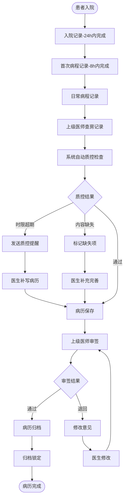
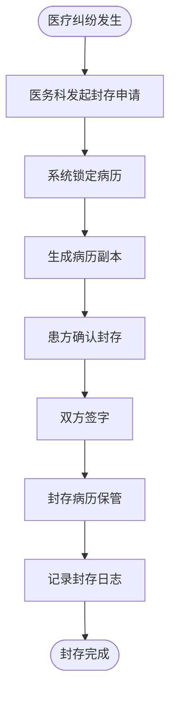

# M03-电子病历 - 业务流程图

> **模块编号**: M03
> **来源文档**: HIS系统-业务流程图.md

---

## 1. 病历书写与质控流程

---

## 2. 病历封存流程（医疗纠纷场景）

---

## 3. 流程统计与监控指标

| 流程 | 关键指标 | 目标值 |
|------|----------|--------|
| 病历质控 | 入院记录完成率(24h) | 100% |
| 病历质控 | 首次病程完成率(8h) | 100% |