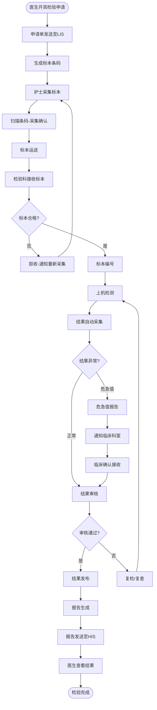

# M04-检验管理 - 业务流程图

> **模块编号**: M04
> **来源文档**: HIS系统-业务流程图.md

---

## 1. 检验全流程

---

## 2. 流程统计与监控指标

| 流程 | 关键指标 | 目标值 |
|------|----------|--------|
| 检验报告 | 常规检验报告时间 | <= 2小时 |
| 危急值 | 危急值通报时间 | <= 15分钟 |