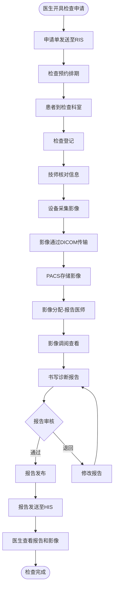

# M05-影像管理 - 业务流程图

> **模块编号**: M05
> **来源文档**: HIS系统-业务流程图.md

---

## 1. 影像检查全流程（DICOM标准）

```mermaid
flowchart TD
    A([医生开具检查申请]) --> B[申请单发送至RIS]
    B --> C[检查预约排期]
    C --> D[患者到检查科室]
    D --> E[检查登记]
    E --> F[技师核对信息]
    F --> G[设备采集影像]
    G --> H[影像通过DICOM传输]
    H --> I[PACS存储影像]
    I --> J[影像分配-报告医师]
    J --> K[影像调阅查看]
    K --> L[书写诊断报告]
    L --> M{报告审核}
    M -- 通过 --> N[报告发布]
    N --> O[报告发送至HIS]
    O --> P[医生查看报告和影像]
    P --> Q([检查完成])
    M -- 退回 --> R[修改报告]
    R --> L
```

---

## 2. 流程统计与监控指标

| 流程 | 关键指标 | 目标值 |
|------|----------|--------|
| 影像报告 | 常规检查报告时间 | <= 4小时 |