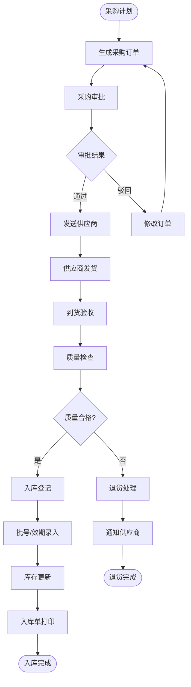
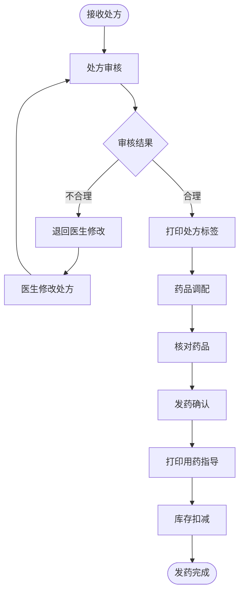
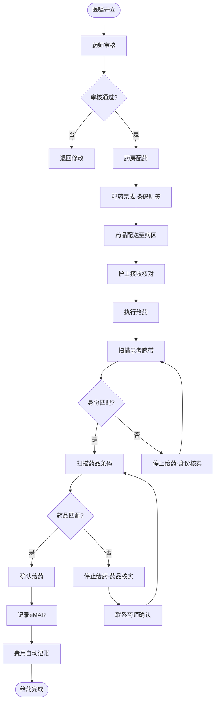

# M06-药品管理 - 业务流程图

> **模块编号**: M06
> **来源文档**: HIS系统-业务流程图.md

---

## 1. 药品采购入库流程

```mermaid
flowchart TD
    A([采购计划]) --> B[生成采购订单]
    B --> C[采购审批]
    C --> D{审批结果}
    D -- 通过 --> E[发送供应商]
    D -- 驳回 --> F[修改订单]
    F --> B
    E --> G[供应商发货]
    G --> H[到货验收]
    H --> I[质量检查]
    I --> J{质量合格?}
    J -- 是 --> K[入库登记]
    K --> L[批号/效期录入]
    L --> M[库存更新]
    M --> N[入库单打印]
    N --> O([入库完成])
    J -- 否 --> P[退货处理]
    P --> Q[通知供应商]
    Q --> R([退货完成])
```

---

## 2. 门诊处方调剂流程

```mermaid
flowchart TD
    A([接收处方]) --> B[处方审核]
    B --> C{审核结果}
    C -- 不合理 --> D[退回医生修改]
    D --> E[医生修改处方]
    E --> B
    C -- 合理 --> F[打印处方标签]
    F --> G[药品调配]
    G --> H[核对药品]
    H --> I[发药确认]
    I --> J[打印用药指导]
    J --> K[库存扣减]
    K --> L([发药完成])
```

---

## 3. 闭环药物管理流程（HIMSS EMRAM Stage 5要求）

```mermaid
flowchart TD
    A([医嘱开立]) --> B[药师审核]
    B --> C{审核通过?}
    C -- 否 --> D[退回修改]
    C -- 是 --> E[药房配药]
    E --> F[配药完成-条码贴签]
    F --> G[药品配送至病区]
    G --> H[护士接收核对]
    H --> I[执行给药]
    I --> J[扫描患者腕带]
    J --> K{身份匹配?}
    K -- 是 --> L[扫描药品条码]
    K -- 否 --> M[停止给药-身份核实]
    M --> J
    L --> N{药品匹配?}
    N -- 是 --> O[确认给药]
    O --> P[记录eMAR]
    P --> Q[费用自动记账]
    Q --> R([给药完成])
    N -- 否 --> S[停止给药-药品核实]
    S --> T[联系药师确认]
    T --> L
```