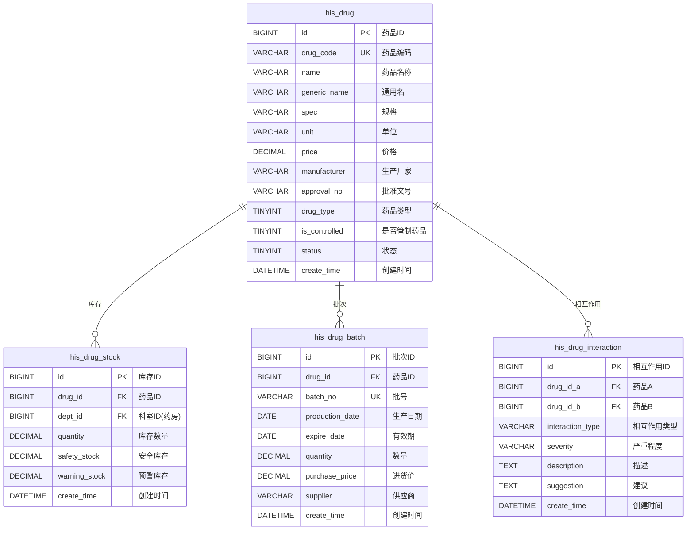

# M06-药品管理 - 数据库设计文档

> **文档编号**: YUDAO-HIS-DB-M06
> **版本**: V1.0
> **创建日期**: 2026-06-17
> **状态**: 设计中
> **参考文档**: YUDAO-HIS-DB-001, YUDAO-HIS-DM-001

---

## 1. 模块概述

### 1.1 模块范围

本模块包含药品业务相关的数据库表设计，包括：
- 药品目录管理
- 药品库存管理
- 药品批次管理
- 药物相互作用管理
- 效期预警管理

### 1.2 模块表清单

| 表名 | 中文名 | FHIR映射 | 年增量估算 |
|------|--------|----------|------------|
| his_drug | 药品目录 | Medication | 约5万条 |
| his_drug_stock | 药品库存 | - | 约10万条 |
| his_drug_batch | 药品批次 | - | 约50万条 |
| his_drug_interaction | 药物相互作用 | - | 约10万条 |

---

## 2. ER图设计

### 2.1 药品域 ER图



---

## 3. DDL脚本设计

### 3.1 药品目录表 (his_drug)

```sql
-- =============================================
-- 药品目录表
-- 年增量估算: 约5万条
-- =============================================
CREATE TABLE `his_drug` (
    `id` BIGINT NOT NULL AUTO_INCREMENT COMMENT '药品ID',
    `drug_code` VARCHAR(50) NOT NULL COMMENT '药品编码',
    `name` VARCHAR(100) NOT NULL COMMENT '药品名称',
    `generic_name` VARCHAR(100) COMMENT '通用名',
    `pinyin_code` VARCHAR(50) COMMENT '拼音码',
    `spec` VARCHAR(50) COMMENT '规格',
    `unit` VARCHAR(20) COMMENT '单位',
    `pack_unit` VARCHAR(20) COMMENT '包装单位',
    `pack_quantity` DECIMAL(10,2) COMMENT '包装数量',
    `price` DECIMAL(10,2) NOT NULL COMMENT '价格',
    `manufacturer` VARCHAR(100) COMMENT '生产厂家',
    `approval_no` VARCHAR(50) COMMENT '批准文号',
    `drug_type` TINYINT NOT NULL COMMENT '药品类型: 1西药/2中成药/3中草药/4生物制品',
    `drug_form` VARCHAR(50) COMMENT '剂型',
    `drug_category` TINYINT COMMENT '药品分类: 1处方药/2非处方药',
    `is_controlled` TINYINT DEFAULT 0 COMMENT '是否管制药品: 0否/1麻醉药品/2精神药品/3毒性药品',
    `is_antibiotic` TINYINT DEFAULT 0 COMMENT '是否抗菌药物: 0否/1是',
    `antibiotic_level` TINYINT COMMENT '抗菌药物级别: 1非限制/2限制/3特殊',
    `storage_condition` VARCHAR(50) COMMENT '储存条件',
    `is_insurance` TINYINT DEFAULT 1 COMMENT '是否医保药品: 0否/1是',
    `insurance_type` VARCHAR(20) COMMENT '医保类型: 甲类/乙类/丙类',
    `insurance_code` VARCHAR(50) COMMENT '医保编码',
    `status` TINYINT NOT NULL DEFAULT 1 COMMENT '状态: 0停用/1正常',
    `remark` VARCHAR(500) COMMENT '备注',
    `creator` VARCHAR(64) DEFAULT '' COMMENT '创建者',
    `create_time` DATETIME NOT NULL DEFAULT CURRENT_TIMESTAMP COMMENT '创建时间',
    `updater` VARCHAR(64) DEFAULT '' COMMENT '更新者',
    `update_time` DATETIME NOT NULL DEFAULT CURRENT_TIMESTAMP ON UPDATE CURRENT_TIMESTAMP COMMENT '更新时间',
    `deleted` BIT(1) NOT NULL DEFAULT b'0' COMMENT '是否删除',
    `tenant_id` BIGINT NOT NULL DEFAULT 0 COMMENT '租户编号',
    PRIMARY KEY (`id`),
    UNIQUE KEY `uk_drug_code` (`drug_code`),
    KEY `idx_drug_name` (`name`),
    KEY `idx_drug_generic` (`generic_name`),
    KEY `idx_drug_pinyin` (`pinyin_code`),
    KEY `idx_drug_type` (`drug_type`),
    KEY `idx_drug_controlled` (`is_controlled`)
) ENGINE=InnoDB DEFAULT CHARSET=utf8mb4 COLLATE=utf8mb4_unicode_ci COMMENT='药品目录表';
```

### 3.2 药品库存表 (his_drug_stock)

```sql
-- =============================================
-- 药品库存表
-- =============================================
CREATE TABLE `his_drug_stock` (
    `id` BIGINT NOT NULL AUTO_INCREMENT COMMENT '库存ID',
    `drug_id` BIGINT NOT NULL COMMENT '药品ID',
    `drug_code` VARCHAR(50) COMMENT '药品编码',
    `drug_name` VARCHAR(100) COMMENT '药品名称',
    `dept_id` BIGINT NOT NULL COMMENT '科室ID(药房)',
    `dept_name` VARCHAR(100) COMMENT '科室名称',
    `quantity` DECIMAL(10,2) NOT NULL DEFAULT 0.00 COMMENT '库存数量',
    `frozen_quantity` DECIMAL(10,2) DEFAULT 0.00 COMMENT '冻结数量',
    `available_quantity` DECIMAL(10,2) DEFAULT 0.00 COMMENT '可用数量',
    `safety_stock` DECIMAL(10,2) COMMENT '安全库存',
    `warning_stock` DECIMAL(10,2) COMMENT '预警库存',
    `max_stock` DECIMAL(10,2) COMMENT '最大库存',
    `min_stock` DECIMAL(10,2) COMMENT '最小库存',
    `warning_status` TINYINT DEFAULT 0 COMMENT '预警状态: 0正常/1低库存预警/2超库存预警',
    `last_in_time` DATETIME COMMENT '最后入库时间',
    `last_out_time` DATETIME COMMENT '最后出库时间',
    `creator` VARCHAR(64) DEFAULT '' COMMENT '创建者',
    `create_time` DATETIME NOT NULL DEFAULT CURRENT_TIMESTAMP COMMENT '创建时间',
    `updater` VARCHAR(64) DEFAULT '' COMMENT '更新者',
    `update_time` DATETIME NOT NULL DEFAULT CURRENT_TIMESTAMP ON UPDATE CURRENT_TIMESTAMP COMMENT '更新时间',
    `deleted` BIT(1) NOT NULL DEFAULT b'0' COMMENT '是否删除',
    `tenant_id` BIGINT NOT NULL DEFAULT 0 COMMENT '租户编号',
    PRIMARY KEY (`id`),
    UNIQUE KEY `uk_drug_stock` (`drug_id`, `dept_id`),
    KEY `idx_drug_stock_drug` (`drug_id`),
    KEY `idx_drug_stock_dept` (`dept_id`),
    KEY `idx_drug_stock_warning` (`warning_status`),
    CONSTRAINT `fk_drug_stock_drug` FOREIGN KEY (`drug_id`) REFERENCES `his_drug` (`id`)
) ENGINE=InnoDB DEFAULT CHARSET=utf8mb4 COLLATE=utf8mb4_unicode_ci COMMENT='药品库存表';
```

### 3.3 药品批次表 (his_drug_batch)

```sql
-- =============================================
-- 药品批次表
-- =============================================
CREATE TABLE `his_drug_batch` (
    `id` BIGINT NOT NULL AUTO_INCREMENT COMMENT '批次ID',
    `drug_id` BIGINT NOT NULL COMMENT '药品ID',
    `drug_code` VARCHAR(50) COMMENT '药品编码',
    `drug_name` VARCHAR(100) COMMENT '药品名称',
    `batch_no` VARCHAR(50) NOT NULL COMMENT '批号',
    `production_date` DATE COMMENT '生产日期',
    `expire_date` DATE NOT NULL COMMENT '有效期',
    `quantity` DECIMAL(10,2) NOT NULL COMMENT '数量',
    `available_quantity` DECIMAL(10,2) COMMENT '可用数量',
    `purchase_price` DECIMAL(10,2) COMMENT '进货价',
    `retail_price` DECIMAL(10,2) COMMENT '零售价',
    `supplier_id` BIGINT COMMENT '供应商ID',
    `supplier_name` VARCHAR(100) COMMENT '供应商名称',
    `purchase_order_no` VARCHAR(30) COMMENT '采购单号',
    `dept_id` BIGINT NOT NULL COMMENT '科室ID(药房)',
    `dept_name` VARCHAR(100) COMMENT '科室名称',
    `location` VARCHAR(50) COMMENT '存放位置',
    `status` TINYINT NOT NULL DEFAULT 1 COMMENT '状态: 1正常/2近效期/3过期/4已用完',
    `expire_warning` TINYINT DEFAULT 0 COMMENT '效期预警: 0正常/1近效期(<=90天)',
    `creator` VARCHAR(64) DEFAULT '' COMMENT '创建者',
    `create_time` DATETIME NOT NULL DEFAULT CURRENT_TIMESTAMP COMMENT '创建时间',
    `updater` VARCHAR(64) DEFAULT '' COMMENT '更新者',
    `update_time` DATETIME NOT NULL DEFAULT CURRENT_TIMESTAMP ON UPDATE CURRENT_TIMESTAMP COMMENT '更新时间',
    `deleted` BIT(1) NOT NULL DEFAULT b'0' COMMENT '是否删除',
    `tenant_id` BIGINT NOT NULL DEFAULT 0 COMMENT '租户编号',
    PRIMARY KEY (`id`),
    UNIQUE KEY `uk_drug_batch` (`drug_id`, `batch_no`, `dept_id`),
    KEY `idx_drug_batch_drug` (`drug_id`),
    KEY `idx_drug_batch_expire` (`expire_date`),
    KEY `idx_drug_batch_dept` (`dept_id`),
    KEY `idx_drug_batch_status` (`status`),
    CONSTRAINT `fk_drug_batch_drug` FOREIGN KEY (`drug_id`) REFERENCES `his_drug` (`id`)
) ENGINE=InnoDB DEFAULT CHARSET=utf8mb4 COLLATE=utf8mb4_unicode_ci COMMENT='药品批次表';
```

### 3.4 药物相互作用表 (his_drug_interaction)

```sql
-- =============================================
-- 药物相互作用表
-- CDS校验核心表
-- =============================================
CREATE TABLE `his_drug_interaction` (
    `id` BIGINT NOT NULL AUTO_INCREMENT COMMENT '相互作用ID',
    `drug_id_a` BIGINT NOT NULL COMMENT '药品A的ID',
    `drug_code_a` VARCHAR(50) COMMENT '药品A编码',
    `drug_name_a` VARCHAR(100) COMMENT '药品A名称',
    `drug_id_b` BIGINT NOT NULL COMMENT '药品B的ID',
    `drug_code_b` VARCHAR(50) COMMENT '药品B编码',
    `drug_name_b` VARCHAR(100) COMMENT '药品B名称',
    `interaction_type` VARCHAR(50) NOT NULL COMMENT '相互作用类型',
    `severity` VARCHAR(20) NOT NULL COMMENT '严重程度: 轻度/中度/重度/禁忌',
    `mechanism` TEXT COMMENT '作用机制',
    `description` TEXT NOT NULL COMMENT '相互作用描述',
    `clinical_effect` TEXT COMMENT '临床影响',
    `suggestion` TEXT COMMENT '处置建议',
    `reference` VARCHAR(500) COMMENT '参考文献',
    `status` TINYINT NOT NULL DEFAULT 1 COMMENT '状态: 0停用/1正常',
    `creator` VARCHAR(64) DEFAULT '' COMMENT '创建者',
    `create_time` DATETIME NOT NULL DEFAULT CURRENT_TIMESTAMP COMMENT '创建时间',
    `updater` VARCHAR(64) DEFAULT '' COMMENT '更新者',
    `update_time` DATETIME NOT NULL DEFAULT CURRENT_TIMESTAMP ON UPDATE CURRENT_TIMESTAMP COMMENT '更新时间',
    `deleted` BIT(1) NOT NULL DEFAULT b'0' COMMENT '是否删除',
    `tenant_id` BIGINT NOT NULL DEFAULT 0 COMMENT '租户编号',
    PRIMARY KEY (`id`),
    UNIQUE KEY `uk_drug_interaction` (`drug_id_a`, `drug_id_b`),
    KEY `idx_interaction_drug_a` (`drug_id_a`),
    KEY `idx_interaction_drug_b` (`drug_id_b`),
    KEY `idx_interaction_severity` (`severity`)
) ENGINE=InnoDB DEFAULT CHARSET=utf8mb4 COLLATE=utf8mb4_unicode_ci COMMENT='药物相互作用表';
```

---

## 4. 索引设计

### 4.1 索引汇总表

| 表名 | 索引名 | 索引类型 | 索引字段 | 说明 |
|------|--------|----------|----------|------|
| his_drug | uk_drug_code | 唯一 | drug_code | 药品编码唯一 |
| his_drug | idx_drug_name | 普通 | name | 按药品名称查询 |
| his_drug | idx_drug_generic | 普通 | generic_name | 按通用名查询 |
| his_drug | idx_drug_pinyin | 普通 | pinyin_code | 按拼音码查询 |
| his_drug | idx_drug_type | 普通 | drug_type | 按药品类型查询 |
| his_drug | idx_drug_controlled | 普通 | is_controlled | 按管制药品查询 |
| his_drug_stock | uk_drug_stock | 唯一 | drug_id, dept_id | 药品+科室唯一 |
| his_drug_stock | idx_drug_stock_drug | 普通 | drug_id | 按药品查询库存 |
| his_drug_stock | idx_drug_stock_dept | 普通 | dept_id | 按科室(药房)查询 |
| his_drug_stock | idx_drug_stock_warning | 普通 | warning_status | 按预警状态查询 |
| his_drug_batch | uk_drug_batch | 唯一 | drug_id, batch_no, dept_id | 药品+批号+科室唯一 |
| his_drug_batch | idx_drug_batch_drug | 普通 | drug_id | 按药品查询批次 |
| his_drug_batch | idx_drug_batch_expire | 普通 | expire_date | 按效期查询 |
| his_drug_batch | idx_drug_batch_status | 普通 | status | 按批次状态查询 |
| his_drug_interaction | uk_drug_interaction | 唯一 | drug_id_a, drug_id_b | 药品组合唯一 |
| his_drug_interaction | idx_interaction_drug_a | 普通 | drug_id_a | 按药品A查询 |
| his_drug_interaction | idx_interaction_drug_b | 普通 | drug_id_b | 按药品B查询 |
| his_drug_interaction | idx_interaction_severity | 普通 | severity | 按严重程度查询 |

---

## 5. 业务规则约束

### 5.1 库存管理规则

- BR-PHARM-001: 药品入库必须验收(品名、规格、批号、效期、数量)
- BR-PHARM-002: 近效期预警(<=90天自动预警)
- BR-PHARM-003: 先进先出原则(优先出近效期批次)
- BR-PHARM-007: 库存安全预警(低于最低库存预警)
- BR-PHARM-009: 发药库存扣减原子性
- BR-PHARM-020: 过期药品禁止出库

### 5.2 特殊药品管理规则

- BR-PHARM-004: 麻醉药品五专管理(专人、专柜、专锁、专账、专方)
- BR-PHARM-008: 抗菌药物分级管理(特殊级需副高以上医师开立)

### 5.3 效期状态流转

| 状态值 | 状态名称 | 触发条件 |
|--------|----------|----------|
| 1 | 正常 | 效期>90天 |
| 2 | 近效期 | 效期<=90天 |
| 3 | 过期 | 效期<当前日期 |
| 4 | 已用完 | 可用数量=0 |

---

## 6. FHIR资源映射

| HIS实体 | FHIR资源 | 映射说明 |
|---------|----------|----------|
| his_drug | Medication | 药品目录信息 |

---

## 7. 变更历史

| 版本 | 日期 | 变更内容 | 变更人 |
|------|------|----------|--------|
| V1.0 | 2026-06-17 | 从全局数据库设计文档拆分创建 | Claude AI |

---

> **模块负责人**: ________________
> **最后更新**: 2026-06-17