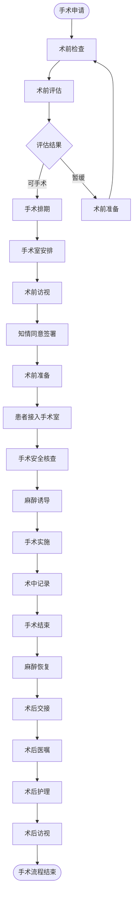

# M07-手术麻醉 - 业务流程图

> **模块编号**: M07
> **来源文档**: HIS系统-业务流程图.md

---

## 1. 手术流程

```mermaid
flowchart TD
    A([手术申请]) --> B[术前检查]
    B --> C[术前评估]
    C --> D{评估结果}
    D -- 可手术 --> E[手术排期]
    D -- 暂缓 --> F[术前准备]
    F --> B
    E --> G[手术室安排]
    G --> H[术前访视]
    H --> I[知情同意签署]
    I --> J[术前准备]
    J --> K[患者接入手术室]
    K --> L[手术安全核查]
    L --> M[麻醉诱导]
    M --> N[手术实施]
    N --> O[术中记录]
    O --> P[手术结束]
    P --> Q[麻醉恢复]
    Q --> R[术后交接]
    R --> S[术后医嘱]
    S --> T[术后护理]
    T --> U[术后访视]
    U --> V([手术流程结束])
```