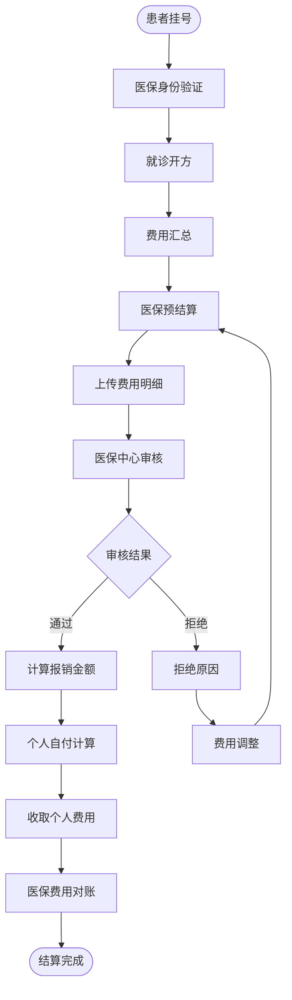

# M08-财务管理 - 业务流程图

> **模块编号**: M08
> **来源文档**: HIS系统-业务流程图.md

---

## 1. 医保结算流程

### 1.1 门诊医保结算

```mermaid
flowchart TD
    A([患者挂号]) --> B[医保身份验证]
    B --> C[就诊开方]
    C --> D[费用汇总]
    D --> E[医保预结算]
    E --> F[上传费用明细]
    F --> G[医保中心审核]
    G --> H{审核结果}
    H -- 通过 --> I[计算报销金额]
    I --> J[个人自付计算]
    J --> K[收取个人费用]
    K --> L[医保费用对账]
    L --> M([结算完成])
    H -- 拒绝 --> N[拒绝原因]
    N --> O[费用调整]
    O --> E
```