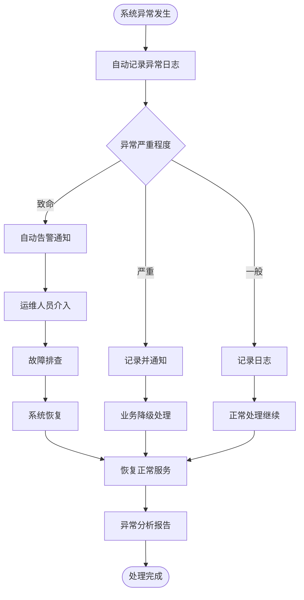

# M09-系统管理 - 业务流程图

> **模块编号**: M09
> **来源文档**: HIS系统-业务流程图.md

---

## 1. 系统异常处理流程

```mermaid
flowchart TD
    A([系统异常发生]) --> B[自动记录异常日志]
    B --> C{异常严重程度}
    C -- 致命 --> D[自动告警通知]
    D --> E[运维人员介入]
    E --> F[故障排查]
    F --> G[系统恢复]
    C -- 严重 --> H[记录并通知]
    H --> I[业务降级处理]
    C -- 一般 --> J[记录日志]
    J --> K[正常处理继续]
    G --> L[恢复正常服务]
    I --> L
    K --> L
    L --> M[异常分析报告]
    M --> N([处理完成])
```