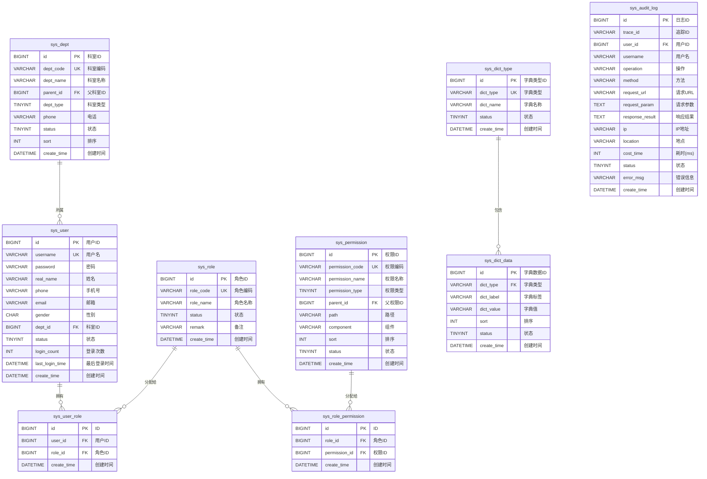

# M09-系统管理 - 数据库设计文档

> **文档编号**: YUDAO-HIS-DB-M09
> **版本**: V1.0
> **创建日期**: 2026-06-17
> **状态**: 设计中
> **参考文档**: YUDAO-HIS-DB-001, YUDAO-HIS-DM-001

---

## 1. 模块概述

### 1.1 模块范围

本模块包含系统管理相关的数据库表设计，包括：
- 用户管理
- 角色管理
- 权限管理
- 科室管理
- 数据字典管理
- 审计日志管理

### 1.2 模块表清单

| 表名 | 中文名 | FHIR映射 | 数据量级 |
|------|--------|----------|----------|
| sys_user | 用户表 | Practitioner | 约1万条 |
| sys_role | 角色表 | - | 约100条 |
| sys_permission | 权限表 | - | 约1000条 |
| sys_user_role | 用户角色关联表 | - | 约5万条 |
| sys_role_permission | 角色权限关联表 | - | 约5万条 |
| sys_dept | 科室表 | Organization | 约500条 |
| sys_dict_type | 数据字典类型表 | - | 约200条 |
| sys_dict_data | 数据字典数据表 | - | 约5000条 |
| sys_audit_log | 审计日志表 | - | 约1亿条/年 |

---

## 2. ER图设计

### 2.1 系统域 ER图



---

## 3. DDL脚本设计

### 3.1 用户表 (sys_user)

```sql
-- =============================================
-- 用户表
-- =============================================
CREATE TABLE `sys_user` (
    `id` BIGINT NOT NULL AUTO_INCREMENT COMMENT '用户ID',
    `username` VARCHAR(50) NOT NULL COMMENT '用户名',
    `password` VARCHAR(100) NOT NULL COMMENT '密码(加密)',
    `salt` VARCHAR(50) COMMENT '盐值',
    `real_name` VARCHAR(50) NOT NULL COMMENT '姓名',
    `gender` CHAR(1) DEFAULT '1' COMMENT '性别: 1男/2女',
    `phone` VARCHAR(20) COMMENT '手机号',
    `email` VARCHAR(100) COMMENT '邮箱',
    `avatar` VARCHAR(200) COMMENT '头像URL',
    `dept_id` BIGINT COMMENT '科室ID',
    `title` VARCHAR(50) COMMENT '职称',
    `position` VARCHAR(50) COMMENT '职务',
    `employee_no` VARCHAR(50) COMMENT '工号',
    `id_card_no` VARCHAR(18) COMMENT '身份证号',
    `signature_url` VARCHAR(200) COMMENT '电子签名URL',
    `status` TINYINT NOT NULL DEFAULT 1 COMMENT '状态: 0禁用/1正常',
    `login_count` INT DEFAULT 0 COMMENT '登录次数',
    `last_login_time` DATETIME COMMENT '最后登录时间',
    `last_login_ip` VARCHAR(50) COMMENT '最后登录IP',
    `fail_count` INT DEFAULT 0 COMMENT '连续登录失败次数',
    `lock_time` DATETIME COMMENT '锁定时间',
    `password_update_time` DATETIME COMMENT '密码修改时间',
    `remark` VARCHAR(500) COMMENT '备注',
    `creator` VARCHAR(64) DEFAULT '' COMMENT '创建者',
    `create_time` DATETIME NOT NULL DEFAULT CURRENT_TIMESTAMP COMMENT '创建时间',
    `updater` VARCHAR(64) DEFAULT '' COMMENT '更新者',
    `update_time` DATETIME NOT NULL DEFAULT CURRENT_TIMESTAMP ON UPDATE CURRENT_TIMESTAMP COMMENT '更新时间',
    `deleted` BIT(1) NOT NULL DEFAULT b'0' COMMENT '是否删除',
    `tenant_id` BIGINT NOT NULL DEFAULT 0 COMMENT '租户编号',
    PRIMARY KEY (`id`),
    UNIQUE KEY `uk_username` (`username`),
    UNIQUE KEY `uk_employee_no` (`employee_no`),
    KEY `idx_user_dept` (`dept_id`),
    KEY `idx_user_status` (`status`),
    KEY `idx_user_phone` (`phone`)
) ENGINE=InnoDB DEFAULT CHARSET=utf8mb4 COLLATE=utf8mb4_unicode_ci COMMENT='用户表';
```

### 3.2 角色表 (sys_role)

```sql
-- =============================================
-- 角色表
-- =============================================
CREATE TABLE `sys_role` (
    `id` BIGINT NOT NULL AUTO_INCREMENT COMMENT '角色ID',
    `role_code` VARCHAR(50) NOT NULL COMMENT '角色编码',
    `role_name` VARCHAR(50) NOT NULL COMMENT '角色名称',
    `role_type` TINYINT DEFAULT 1 COMMENT '角色类型: 1系统角色/2业务角色/3自定义角色',
    `data_scope` TINYINT DEFAULT 1 COMMENT '数据权限: 1全部/2本部门/3本部门及下级/4仅本人/5自定义',
    `status` TINYINT NOT NULL DEFAULT 1 COMMENT '状态: 0禁用/1正常',
    `sort` INT DEFAULT 0 COMMENT '排序',
    `remark` VARCHAR(500) COMMENT '备注',
    `creator` VARCHAR(64) DEFAULT '' COMMENT '创建者',
    `create_time` DATETIME NOT NULL DEFAULT CURRENT_TIMESTAMP COMMENT '创建时间',
    `updater` VARCHAR(64) DEFAULT '' COMMENT '更新者',
    `update_time` DATETIME NOT NULL DEFAULT CURRENT_TIMESTAMP ON UPDATE CURRENT_TIMESTAMP COMMENT '更新时间',
    `deleted` BIT(1) NOT NULL DEFAULT b'0' COMMENT '是否删除',
    `tenant_id` BIGINT NOT NULL DEFAULT 0 COMMENT '租户编号',
    PRIMARY KEY (`id`),
    UNIQUE KEY `uk_role_code` (`role_code`),
    KEY `idx_role_status` (`status`)
) ENGINE=InnoDB DEFAULT CHARSET=utf8mb4 COLLATE=utf8mb4_unicode_ci COMMENT='角色表';
```

### 3.3 权限表 (sys_permission)

```sql
-- =============================================
-- 权限表(菜单/按钮权限)
-- =============================================
CREATE TABLE `sys_permission` (
    `id` BIGINT NOT NULL AUTO_INCREMENT COMMENT '权限ID',
    `permission_code` VARCHAR(100) NOT NULL COMMENT '权限编码',
    `permission_name` VARCHAR(50) NOT NULL COMMENT '权限名称',
    `permission_type` TINYINT NOT NULL COMMENT '权限类型: 1菜单/2按钮/3接口',
    `parent_id` BIGINT DEFAULT 0 COMMENT '父权限ID',
    `path` VARCHAR(200) COMMENT '路由路径',
    `component` VARCHAR(200) COMMENT '组件路径',
    `redirect` VARCHAR(200) COMMENT '重定向路径',
    `icon` VARCHAR(50) COMMENT '图标',
    `sort` INT DEFAULT 0 COMMENT '排序',
    `visible` TINYINT DEFAULT 1 COMMENT '是否可见: 0否/1是',
    `status` TINYINT NOT NULL DEFAULT 1 COMMENT '状态: 0禁用/1正常',
    `cache` TINYINT DEFAULT 0 COMMENT '是否缓存: 0否/1是',
    `external` TINYINT DEFAULT 0 COMMENT '是否外链: 0否/1是',
    `remark` VARCHAR(500) COMMENT '备注',
    `creator` VARCHAR(64) DEFAULT '' COMMENT '创建者',
    `create_time` DATETIME NOT NULL DEFAULT CURRENT_TIMESTAMP COMMENT '创建时间',
    `updater` VARCHAR(64) DEFAULT '' COMMENT '更新者',
    `update_time` DATETIME NOT NULL DEFAULT CURRENT_TIMESTAMP ON UPDATE CURRENT_TIMESTAMP COMMENT '更新时间',
    `deleted` BIT(1) NOT NULL DEFAULT b'0' COMMENT '是否删除',
    `tenant_id` BIGINT NOT NULL DEFAULT 0 COMMENT '租户编号',
    PRIMARY KEY (`id`),
    UNIQUE KEY `uk_permission_code` (`permission_code`),
    KEY `idx_permission_parent` (`parent_id`),
    KEY `idx_permission_type` (`permission_type`),
    KEY `idx_permission_status` (`status`)
) ENGINE=InnoDB DEFAULT CHARSET=utf8mb4 COLLATE=utf8mb4_unicode_ci COMMENT='权限表';
```

### 3.4 用户角色关联表 (sys_user_role)

```sql
-- =============================================
-- 用户角色关联表
-- =============================================
CREATE TABLE `sys_user_role` (
    `id` BIGINT NOT NULL AUTO_INCREMENT COMMENT 'ID',
    `user_id` BIGINT NOT NULL COMMENT '用户ID',
    `role_id` BIGINT NOT NULL COMMENT '角色ID',
    `creator` VARCHAR(64) DEFAULT '' COMMENT '创建者',
    `create_time` DATETIME NOT NULL DEFAULT CURRENT_TIMESTAMP COMMENT '创建时间',
    `updater` VARCHAR(64) DEFAULT '' COMMENT '更新者',
    `update_time` DATETIME NOT NULL DEFAULT CURRENT_TIMESTAMP ON UPDATE CURRENT_TIMESTAMP COMMENT '更新时间',
    `deleted` BIT(1) NOT NULL DEFAULT b'0' COMMENT '是否删除',
    `tenant_id` BIGINT NOT NULL DEFAULT 0 COMMENT '租户编号',
    PRIMARY KEY (`id`),
    UNIQUE KEY `uk_user_role` (`user_id`, `role_id`),
    KEY `idx_user_role_user` (`user_id`),
    KEY `idx_user_role_role` (`role_id`),
    CONSTRAINT `fk_user_role_user` FOREIGN KEY (`user_id`) REFERENCES `sys_user` (`id`),
    CONSTRAINT `fk_user_role_role` FOREIGN KEY (`role_id`) REFERENCES `sys_role` (`id`)
) ENGINE=InnoDB DEFAULT CHARSET=utf8mb4 COLLATE=utf8mb4_unicode_ci COMMENT='用户角色关联表';
```

### 3.5 角色权限关联表 (sys_role_permission)

```sql
-- =============================================
-- 角色权限关联表
-- =============================================
CREATE TABLE `sys_role_permission` (
    `id` BIGINT NOT NULL AUTO_INCREMENT COMMENT 'ID',
    `role_id` BIGINT NOT NULL COMMENT '角色ID',
    `permission_id` BIGINT NOT NULL COMMENT '权限ID',
    `creator` VARCHAR(64) DEFAULT '' COMMENT '创建者',
    `create_time` DATETIME NOT NULL DEFAULT CURRENT_TIMESTAMP COMMENT '创建时间',
    `updater` VARCHAR(64) DEFAULT '' COMMENT '更新者',
    `update_time` DATETIME NOT NULL DEFAULT CURRENT_TIMESTAMP ON UPDATE CURRENT_TIMESTAMP COMMENT '更新时间',
    `deleted` BIT(1) NOT NULL DEFAULT b'0' COMMENT '是否删除',
    `tenant_id` BIGINT NOT NULL DEFAULT 0 COMMENT '租户编号',
    PRIMARY KEY (`id`),
    UNIQUE KEY `uk_role_permission` (`role_id`, `permission_id`),
    KEY `idx_role_permission_role` (`role_id`),
    KEY `idx_role_permission_permission` (`permission_id`),
    CONSTRAINT `fk_role_permission_role` FOREIGN KEY (`role_id`) REFERENCES `sys_role` (`id`),
    CONSTRAINT `fk_role_permission_permission` FOREIGN KEY (`permission_id`) REFERENCES `sys_permission` (`id`)
) ENGINE=InnoDB DEFAULT CHARSET=utf8mb4 COLLATE=utf8mb4_unicode_ci COMMENT='角色权限关联表';
```

### 3.6 科室表 (sys_dept)

```sql
-- =============================================
-- 科室表
-- 对应FHIR资源: Organization
-- =============================================
CREATE TABLE `sys_dept` (
    `id` BIGINT NOT NULL AUTO_INCREMENT COMMENT '科室ID',
    `dept_code` VARCHAR(50) NOT NULL COMMENT '科室编码',
    `dept_name` VARCHAR(100) NOT NULL COMMENT '科室名称',
    `dept_short_name` VARCHAR(50) COMMENT '科室简称',
    `parent_id` BIGINT DEFAULT 0 COMMENT '父科室ID',
    `dept_type` TINYINT NOT NULL COMMENT '科室类型: 1临床科室/2医技科室/3行政科室/4后勤科室',
    `dept_category` VARCHAR(50) COMMENT '科室分类: 内科/外科/妇科/儿科等',
    `phone` VARCHAR(20) COMMENT '电话',
    `fax` VARCHAR(20) COMMENT '传真',
    `email` VARCHAR(100) COMMENT '邮箱',
    `address` VARCHAR(200) COMMENT '地址',
    `leader_id` BIGINT COMMENT '科室主任ID',
    `leader_name` VARCHAR(50) COMMENT '科室主任姓名',
    `nurse_leader_id` BIGINT COMMENT '护士长ID',
    `nurse_leader_name` VARCHAR(50) COMMENT '护士长姓名',
    `bed_count` INT DEFAULT 0 COMMENT '床位数',
    `sort` INT DEFAULT 0 COMMENT '排序',
    `status` TINYINT NOT NULL DEFAULT 1 COMMENT '状态: 0禁用/1正常',
    `remark` VARCHAR(500) COMMENT '备注',
    `creator` VARCHAR(64) DEFAULT '' COMMENT '创建者',
    `create_time` DATETIME NOT NULL DEFAULT CURRENT_TIMESTAMP COMMENT '创建时间',
    `updater` VARCHAR(64) DEFAULT '' COMMENT '更新者',
    `update_time` DATETIME NOT NULL DEFAULT CURRENT_TIMESTAMP ON UPDATE CURRENT_TIMESTAMP COMMENT '更新时间',
    `deleted` BIT(1) NOT NULL DEFAULT b'0' COMMENT '是否删除',
    `tenant_id` BIGINT NOT NULL DEFAULT 0 COMMENT '租户编号',
    PRIMARY KEY (`id`),
    UNIQUE KEY `uk_dept_code` (`dept_code`),
    KEY `idx_dept_parent` (`parent_id`),
    KEY `idx_dept_type` (`dept_type`),
    KEY `idx_dept_status` (`status`)
) ENGINE=InnoDB DEFAULT CHARSET=utf8mb4 COLLATE=utf8mb4_unicode_ci COMMENT='科室表';
```

### 3.7 数据字典类型表 (sys_dict_type)

```sql
-- =============================================
-- 数据字典类型表
-- =============================================
CREATE TABLE `sys_dict_type` (
    `id` BIGINT NOT NULL AUTO_INCREMENT COMMENT '字典类型ID',
    `dict_type` VARCHAR(100) NOT NULL COMMENT '字典类型',
    `dict_name` VARCHAR(100) NOT NULL COMMENT '字典名称',
    `status` TINYINT NOT NULL DEFAULT 1 COMMENT '状态: 0禁用/1正常',
    `remark` VARCHAR(500) COMMENT '备注',
    `creator` VARCHAR(64) DEFAULT '' COMMENT '创建者',
    `create_time` DATETIME NOT NULL DEFAULT CURRENT_TIMESTAMP COMMENT '创建时间',
    `updater` VARCHAR(64) DEFAULT '' COMMENT '更新者',
    `update_time` DATETIME NOT NULL DEFAULT CURRENT_TIMESTAMP ON UPDATE CURRENT_TIMESTAMP COMMENT '更新时间',
    `deleted` BIT(1) NOT NULL DEFAULT b'0' COMMENT '是否删除',
    `tenant_id` BIGINT NOT NULL DEFAULT 0 COMMENT '租户编号',
    PRIMARY KEY (`id`),
    UNIQUE KEY `uk_dict_type` (`dict_type`),
    KEY `idx_dict_type_status` (`status`)
) ENGINE=InnoDB DEFAULT CHARSET=utf8mb4 COLLATE=utf8mb4_unicode_ci COMMENT='数据字典类型表';
```

### 3.8 数据字典数据表 (sys_dict_data)

```sql
-- =============================================
-- 数据字典数据表
-- =============================================
CREATE TABLE `sys_dict_data` (
    `id` BIGINT NOT NULL AUTO_INCREMENT COMMENT '字典数据ID',
    `dict_type` VARCHAR(100) NOT NULL COMMENT '字典类型',
    `dict_label` VARCHAR(100) NOT NULL COMMENT '字典标签',
    `dict_value` VARCHAR(100) NOT NULL COMMENT '字典值',
    `dict_code` VARCHAR(100) COMMENT '字典编码(用于程序判断)',
    `css_class` VARCHAR(50) COMMENT 'CSS样式',
    `list_class` VARCHAR(50) COMMENT '列表样式',
    `is_default` TINYINT DEFAULT 0 COMMENT '是否默认: 0否/1是',
    `sort` INT DEFAULT 0 COMMENT '排序',
    `status` TINYINT NOT NULL DEFAULT 1 COMMENT '状态: 0禁用/1正常',
    `remark` VARCHAR(500) COMMENT '备注',
    `creator` VARCHAR(64) DEFAULT '' COMMENT '创建者',
    `create_time` DATETIME NOT NULL DEFAULT CURRENT_TIMESTAMP COMMENT '创建时间',
    `updater` VARCHAR(64) DEFAULT '' COMMENT '更新者',
    `update_time` DATETIME NOT NULL DEFAULT CURRENT_TIMESTAMP ON UPDATE CURRENT_TIMESTAMP COMMENT '更新时间',
    `deleted` BIT(1) NOT NULL DEFAULT b'0' COMMENT '是否删除',
    `tenant_id` BIGINT NOT NULL DEFAULT 0 COMMENT '租户编号',
    PRIMARY KEY (`id`),
    KEY `idx_dict_data_type` (`dict_type`),
    KEY `idx_dict_data_value` (`dict_value`),
    KEY `idx_dict_data_status` (`status`)
) ENGINE=InnoDB DEFAULT CHARSET=utf8mb4 COLLATE=utf8mb4_unicode_ci COMMENT='数据字典数据表';
```

### 3.9 审计日志表 (sys_audit_log)

```sql
-- =============================================
-- 审计日志表
-- 分表策略: 按月分表
-- 保留期限: >=3年(等保要求)
-- 日志不可删除、不可修改
-- =============================================
CREATE TABLE `sys_audit_log` (
    `id` BIGINT NOT NULL AUTO_INCREMENT COMMENT '日志ID',
    `trace_id` VARCHAR(64) COMMENT '追踪ID',
    `span_id` VARCHAR(64) COMMENT '跨度ID',
    `user_id` BIGINT COMMENT '用户ID',
    `username` VARCHAR(50) COMMENT '用户名',
    `real_name` VARCHAR(50) COMMENT '姓名',
    `dept_id` BIGINT COMMENT '科室ID',
    `dept_name` VARCHAR(100) COMMENT '科室名称',
    `operation` VARCHAR(100) COMMENT '操作名称',
    `method` VARCHAR(200) COMMENT '方法名称',
    `request_url` VARCHAR(500) COMMENT '请求URL',
    `request_method` VARCHAR(10) COMMENT '请求方式: GET/POST/PUT/DELETE',
    `request_param` TEXT COMMENT '请求参数',
    `response_result` TEXT COMMENT '响应结果',
    `ip` VARCHAR(50) COMMENT 'IP地址',
    `location` VARCHAR(100) COMMENT '操作地点',
    `browser` VARCHAR(100) COMMENT '浏览器',
    `os` VARCHAR(100) COMMENT '操作系统',
    `device` VARCHAR(100) COMMENT '设备类型',
    `cost_time` INT COMMENT '耗时(毫秒)',
    `status` TINYINT DEFAULT 1 COMMENT '状态: 1成功/2失败',
    `error_msg` TEXT COMMENT '错误信息',
    `business_type` VARCHAR(50) COMMENT '业务类型',
    `business_id` VARCHAR(100) COMMENT '业务ID',
    `before_data` TEXT COMMENT '操作前数据',
    `after_data` TEXT COMMENT '操作后数据',
    `create_time` DATETIME NOT NULL DEFAULT CURRENT_TIMESTAMP COMMENT '创建时间',
    PRIMARY KEY (`id`),
    KEY `idx_audit_log_user` (`user_id`),
    KEY `idx_audit_log_time` (`create_time`),
    KEY `idx_audit_log_operation` (`operation`),
    KEY `idx_audit_log_ip` (`ip`),
    KEY `idx_audit_log_status` (`status`),
    KEY `idx_audit_log_trace` (`trace_id`),
    KEY `idx_audit_log_business` (`business_type`, `business_id`),
    KEY `idx_audit_log_month` (DATE_FORMAT(`create_time`, '%Y%m'))
) ENGINE=InnoDB DEFAULT CHARSET=utf8mb4 COLLATE=utf8mb4_unicode_ci COMMENT='审计日志表';
```

---

## 4. 索引设计

### 4.1 索引汇总表

| 表名 | 索引名 | 索引类型 | 索引字段 | 说明 |
|------|--------|----------|----------|------|
| sys_user | uk_username | 唯一 | username | 用户名唯一 |
| sys_user | uk_employee_no | 唯一 | employee_no | 工号唯一 |
| sys_user | idx_user_dept | 普通 | dept_id | 按科室查询用户 |
| sys_user | idx_user_status | 普通 | status | 按状态查询 |
| sys_role | uk_role_code | 唯一 | role_code | 角色编码唯一 |
| sys_permission | uk_permission_code | 唯一 | permission_code | 权限编码唯一 |
| sys_permission | idx_permission_parent | 普通 | parent_id | 按父权限查询 |
| sys_user_role | uk_user_role | 唯一 | user_id, role_id | 用户角色组合唯一 |
| sys_role_permission | uk_role_permission | 唯一 | role_id, permission_id | 角色权限组合唯一 |
| sys_dept | uk_dept_code | 唯一 | dept_code | 科室编码唯一 |
| sys_dept | idx_dept_parent | 普通 | parent_id | 按父科室查询 |
| sys_dict_type | uk_dict_type | 唯一 | dict_type | 字典类型唯一 |
| sys_dict_data | idx_dict_data_type | 普通 | dict_type | 按字典类型查询 |
| sys_audit_log | idx_audit_log_user | 普通 | user_id | 按用户查询日志 |
| sys_audit_log | idx_audit_log_time | 普通 | create_time | 按时间查询日志 |
| sys_audit_log | idx_audit_log_operation | 普通 | operation | 按操作类型查询 |
| sys_audit_log | idx_audit_log_month | 普通 | DATE_FORMAT(create_time, '%Y%m') | 按月份查询 |

---

## 5. 分表策略

| 数据表 | 分表策略 | 分表字段 | 说明 |
|--------|----------|----------|------|
| sys_audit_log | 按月分表 | create_time | 审计日志数据量极大，约1亿条/年，等保要求保留>=3年 |

### 5.1 分表实现示例

```sql
-- =============================================
-- 审计日志分表示例(按月)
-- =============================================
-- 2026年6月审计日志表
CREATE TABLE `sys_audit_log_202606` LIKE `sys_audit_log`;

-- 2026年7月审计日志表
CREATE TABLE `sys_audit_log_202607` LIKE `sys_audit_log`;
```

---

## 6. FHIR资源映射

| HIS实体 | FHIR资源 | 映射说明 |
|---------|----------|----------|
| sys_user | Practitioner | 医护人员信息 |
| sys_dept | Organization | 科室机构信息 |

---

## 7. 业务规则约束

### 7.1 用户管理规则

- BR-SYS-001: 用户名唯一，格式校验^[a-zA-Z][a-zA-Z0-9_]{2,19}$
- BR-SYS-002: 密码复杂度要求>=8位，含3类字符
- BR-SYS-003: 连续失败5次锁定30分钟
- BR-SYS-004: 密码必须加密存储

### 7.2 角色权限规则

- BR-SYS-010: 角色标识唯一
- BR-SYS-011: 有用户分配的角色不可删除
- BR-SYS-012: 菜单权限控制未授权菜单隐藏
- BR-SYS-013: 按钮权限控制未授权按钮隐藏
- BR-SYS-014: 数据权限按范围过滤数据

### 7.3 科室管理规则

- BR-SYS-015: 科室编码唯一
- BR-SYS-016: 有下级科室不可删除
- BR-SYS-017: 有关联用户不可删除
- BR-SYS-042: 科室层级最大5级

### 7.4 数据字典规则

- BR-SYS-018: 字典类型编码唯一
- BR-SYS-006: 被引用字典数据不可删除，只能停用
- BR-SYS-007: 字典变更必须记录版本历史
- BR-SYS-020: 停用数据下拉不显示

### 7.5 审计日志规则

- BR-SYS-005: 日志只增不改，禁止UPDATE/DELETE
- BR-SYS-021: 关键操作必须记录日志
- BR-SYS-022: 登录成功/失败必须记录
- BR-SYS-023: 敏感数据脱敏存储
- BR-SYS-051: 日志保留>=3年

---

## 8. 数据字典初始化

### 8.1 核心字典类型

| 字典类型 | 字典名称 | 数据量 |
|----------|----------|--------|
| gender | 性别字典 | 3条 |
| insurance_type | 医保类型 | 5条 |
| register_type | 挂号类型 | 3条 |
| pay_type | 支付方式 | 5条 |
| register_status | 挂号状态 | 4条 |
| order_type | 医嘱类型 | 6条 |
| order_category | 医嘱分类 | 2条 |
| order_status | 医嘱状态 | 6条 |
| nursing_level | 护理等级 | 4条 |
| drug_type | 药品类型 | 4条 |
| triage_level | 急诊分级 | 4条 |
| risk_level | 风险等级 | 4条 |

---

## 9. 变更历史

| 版本 | 日期 | 变更内容 | 变更人 |
|------|------|----------|--------|
| V1.0 | 2026-06-17 | 从全局数据库设计文档拆分创建 | Claude AI |

---

> **模块负责人**: ________________
> **最后更新**: 2026-06-17