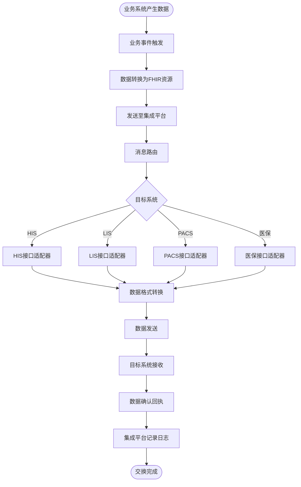
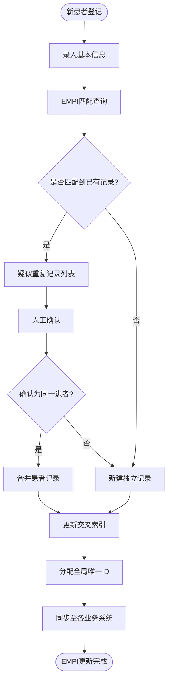

# M10-集成平台 - 业务流程图

> **模块编号**: M10
> **来源文档**: HIS系统-业务流程图.md

---

## 1. HL7 FHIR数据交换流程

```mermaid
flowchart TD
    A([业务系统产生数据]) --> B[业务事件触发]
    B --> C[数据转换为FHIR资源]
    C --> D[发送至集成平台]
    D --> E[消息路由]
    E --> F{目标系统}
    F -- HIS --> G[HIS接口适配器]
    F -- LIS --> H[LIS接口适配器]
    F -- PACS --> I[PACS接口适配器]
    F -- 医保 --> J[医保接口适配器]
    G --> K[数据格式转换]
    H --> K
    I --> K
    J --> K
    K --> L[数据发送]
    L --> M[目标系统接收]
    M --> N[数据确认回执]
    N --> O[集成平台记录日志]
    O --> P([交换完成])
```

---

## 2. 患者主索引(EMPI)管理流程

```mermaid
flowchart TD
    A([新患者登记]) --> B[录入基本信息]
    B --> C[EMPI匹配查询]
    C --> D{是否匹配到已有记录?}
    D -- 是 --> E[疑似重复记录列表]
    E --> F[人工确认]
    F --> G{确认为同一患者?}
    G -- 是 --> H[合并患者记录]
    G -- 否 --> I[新建独立记录]
    D -- 否 --> I
    H --> J[更新交叉索引]
    I --> J
    J --> K[分配全局唯一ID]
    K --> L[同步至各业务系统]
    L --> M([EMPI更新完成])
```