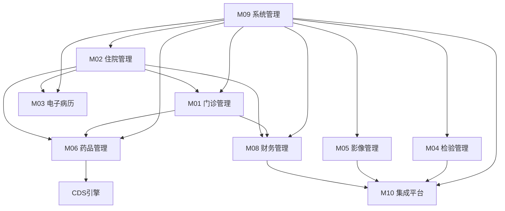

# YUDAO-AI-HIS 文档索引

> **文档编号**: YUDAO-HIS-DOC-INDEX
> **版本**: V1.1
> **创建日期**: 2026-06-17
> **状态**: 规划中

---

## 1. 项目概述

YUDAO-AI-HIS 智慧医疗信息系统，基于 yudao-vue-pro（芋道源码）框架开发，目标达到 HIMSS EMRAM Stage 5+ 水平。

### 1.1 核心特性

- **闭环给药管理**: 腕带+药品条码双重核对，给药差错率降低90%
- **临床决策支持(CDS)**: 药物相互作用、过敏检查、剂量合理性四维校验
- **标准互操作**: 基于HL7 FHIR R4实现院内/院间互联互通
- **AI辅助诊断**: 智能分诊、影像AI、病历质控AI

### 1.2 技术栈

| 层级 | 技术选型 | 版本 |
|------|----------|------|
| 后端框架 | Spring Boot | 3.2.x |
| 前端框架 | Vue 3 + Element Plus | 3.4.x |
| 数据库 | MySQL | 8.0.x |
| 缓存 | Redis | 7.x |
| 消息队列 | RabbitMQ | 3.12.x |

---

## 2. 模块文档索引

### 2.1 P0 核心模块 (MVP)

#### M09-系统管理

| 子模块编号 | 子模块名称 | 功能点需求文档 | 说明 |
|------------|------------|----------------|------|
| M09-01 | 用户管理 | [M09-01-用户管理-功能点需求.md](M09-系统管理/M09-01-用户管理/M09-01-用户管理-功能点需求.md) | 用户账号、密码管理、角色分配 |
| M09-02 | 角色管理 | [M09-02-角色管理-功能点需求.md](M09-系统管理/M09-02-角色管理/M09-02-角色管理-功能点需求.md) | 角色定义、权限配置 |
| M09-03 | 权限管理 | [M09-03-权限管理-功能点需求.md](M09-系统管理/M09-03-权限管理/M09-03-权限管理-功能点需求.md) | RBAC权限控制、数据权限 |
| M09-04 | 组织架构 | [M09-04-组织架构-功能点需求.md](M09-系统管理/M09-04-组织架构/M09-04-组织架构-功能点需求.md) | 科室、病区、岗位管理 |
| M09-05 | 数据字典 | [M09-05-数据字典-功能点需求.md](M09-系统管理/M09-05-数据字典/M09-05-数据字典-功能点需求.md) | 字典类型、字典项管理 |
| M09-06 | 日志管理 | [M09-06-日志管理-功能点需求.md](M09-系统管理/M09-06-日志管理/M09-06-日志管理-功能点需求.md) | 操作日志、审计日志 |

---

#### M01-门诊管理

| 子模块编号 | 子模块名称 | 功能点需求文档 | 说明 |
|------------|------------|----------------|------|
| M01-01 | 挂号管理 | [M01-01-挂号管理-功能点需求.md](M01-门诊管理/M01-01-挂号管理/M01-01-挂号管理-功能点需求.md) | 现场挂号、预约挂号、号源管理、分诊排队 |
| M01-02 | 门诊医生工作站 | [M01-02-门诊医生工作站-功能点需求.md](M01-门诊管理/M01-02-门诊医生工作站/M01-02-门诊医生工作站-功能点需求.md) | 接诊、诊断、处方、检验申请、病历 |
| M01-03 | 门诊收费管理 | [M01-03-门诊收费管理-功能点需求.md](M01-门诊管理/M01-03-门诊收费管理/M01-03-门诊收费管理-功能点需求.md) | 收费结算、医保结算、退费 |
| M01-04 | 门诊药房管理 | [M01-04-门诊药房管理-功能点需求.md](M01-门诊管理/M01-04-门诊药房管理/M01-04-门诊药房管理-功能点需求.md) | 处方接收、审核、调配、发药 |

---

#### M02-住院管理

| 子模块编号 | 子模块名称 | 功能点需求文档 | 说明 |
|------------|------------|----------------|------|
| M02-01 | 入院管理 | [M02-01-入院管理-功能点需求.md](M02-住院管理/M02-01-入院管理/M02-01-入院管理-功能点需求.md) | 入院登记、床位分配、预交金、医保登记 |
| M02-02 | 住院医生工作站 | [M02-02-住院医生工作站-功能点需求.md](M02-住院管理/M02-02-住院医生工作站/M02-02-住院医生工作站-功能点需求.md) | 医嘱开立、病历书写、诊断管理 |
| M02-03 | 护理工作站 | [M02-03-护理工作站-功能点需求.md](M02-住院管理/M02-03-护理工作站/M02-03-护理工作站-功能点需求.md) | 医嘱执行、护理记录、eMAR闭环给药 |
| M02-04 | 床位管理 | [M02-04-床位管理-功能点需求.md](M02-住院管理/M02-04-床位管理/M02-04-床位管理-功能点需求.md) | 床位图、床位状态管理 |
| M02-05 | 出院管理 | [M02-05-出院管理-功能点需求.md](M02-住院管理/M02-05-出院管理/M02-05-出院管理-功能点需求.md) | 出院申请、出院结算、病案归档 |

---

#### M06-药品管理

| 子模块编号 | 子模块名称 | 功能点需求文档 | 说明 |
|------------|------------|----------------|------|
| M06-01 | 药库管理 | [M06-01-药库管理-功能点需求.md](M06-药品管理/M06-01-药库管理/M06-01-药库管理-功能点需求.md) | 药品入库、出库、盘点、效期管理 |
| M06-02 | 采购管理 | [M06-02-采购管理-功能点需求.md](M06-药品管理/M06-02-采购管理/M06-02-采购管理-功能点需求.md) | 采购计划、采购订单、供应商管理 |
| M06-03 | 处方审核与合理用药 | [M06-03-处方审核与合理用药-功能点需求.md](M06-药品管理/M06-03-处方审核与合理用药/M06-03-处方审核与合理用药-功能点需求.md) | CDS校验、药物相互作用、过敏检查 |
| M06-04 | 特殊药品管理 | [M06-04-特殊药品管理-功能点需求.md](M06-药品管理/M06-04-特殊药品管理/M06-04-特殊药品管理-功能点需求.md) | 麻醉药品五专管理 |

---

### 2.2 P1 重要模块

| 模块编号 | 模块名称 | 文档目录 | 核心内容 |
|----------|----------|----------|----------|
| M03 | 电子病历 | [M03-电子病历/](M03-电子病历/) | 病历模板、编辑、审签、归档 |
| M04 | 检验管理 | [M04-检验管理/](M04-检验管理/) | 检验申请、标本、结果、危急值 |
| M05 | 影像管理 | [M05-影像管理/](M05-影像管理/) | 影像申请、DICOM、报告 |
| M07 | 手术麻醉 | [M07-手术麻醉/](M07-手术麻醉/) | 手术排期、麻醉记录 |
| M08 | 财务管理 | [M08-财务管理/](M08-财务管理/) | 收费项目、医保结算、费用记账 |
| M10 | 集成平台 | [M10-集成平台/](M10-集成平台/) | EMPI、主数据、消息引擎 |
| M11 | 患者服务 | [M11-患者服务/](M11-患者服务/) | 患者门户、预约挂号、报告查询 |

### 2.3 P2 增强模块

| 模块编号 | 模块名称 | 文档目录 | 核心内容 |
|----------|----------|----------|----------|
| M12 | 运营管理 | [M12-运营管理/](M12-运营管理/) | 运营看板、统计报表 |
| M13 | AI辅助 | [M13-AI辅助/](M13-AI辅助/) | 智能分诊、影像AI、病历质控 |

---

## 3. 功能点需求文档统计

| 模块 | 功能点需求文档数量 | 状态 |
|------|------------------|------|
| M01 门诊管理 | 4 | ✅ 已完成 |
| M02 住院管理 | 5 | ✅ 已完成 |
| M06 药品管理 | 4 | ✅ 已完成 |
| M09 系统管理 | 6 | ✅ 已完成 |
| **总计** | **19** | - |

---

## 4. 数据库设计汇总

### 4.1 模块数据库表统计

| 模块 | 表数量 | 年增量估算 | 分表策略 |
|------|--------|------------|----------|
| M09 系统管理 | 9张 | 约1亿条日志 | sys_audit_log按月分表 |
| M01 门诊管理 | 9张 | 约200万挂号/年 | 处方明细按年分表 |
| M02 住院管理 | 7张 | 约2000万eMAR/年 | 医嘱/eMAR按年分表 |
| M06 药品管理 | 4张 | 约5万药品 | 无需分表 |
| M03 电子病历 | 6张 | 约100万病历 | 病历文书按年分表 |
| M04 检验管理 | 7张 | 约500万结果/年 | 检验结果按年分表 |
| M05 影像管理 | 5张 | 约100万影像 | DICOM文件对象存储 |
| M08 财务管理 | 8张 | 约3000万费用/年 | 费用明细按年分表 |

### 4.2 核心表清单

**患者域**:
- his_patient (患者主索引)
- his_allergy (过敏记录)
- his_patient_card (就诊卡)

**门诊域**:
- op_schedule (排班)
- op_appointment (预约)
- op_register (挂号)
- op_prescription (处方)

**住院域**:
- his_admission (住院信息)
- his_order (医嘱)
- his_medication_admin (eMAR给药)
- his_nursing_record (护理记录)

**药品域**:
- his_drug (药品目录)
- his_drug_stock (库存)
- his_drug_interaction (相互作用)

**系统域**:
- sys_user, sys_role, sys_permission
- sys_dept, sys_dict_type, sys_dict_data

---

## 5. 模块依赖关系

---

## 6. 开发计划索引

| 文档名称 | 文件路径 | 说明 |
|----------|----------|------|
| 模块开发计划 | [../plan/HIS系统-模块开发计划.md](../plan/HIS系统-模块开发计划.md) | Sprint规划、Agent分配 |
| 项目开发计划 | 外部引用 | 详细时间安排、里程碑 |

---

## 7. 变更历史

| 版本 | 日期 | 变更内容 | 变更人 |
|------|------|----------|--------|
| V1.0 | 2026-06-17 | 初始版本，创建文档索引 | Claude AI |
| V1.1 | 2026-06-17 | 补充P0模块全部功能点需求文档（19个） | Claude AI |

---

> **最后更新**: 2026-06-17